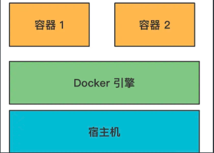
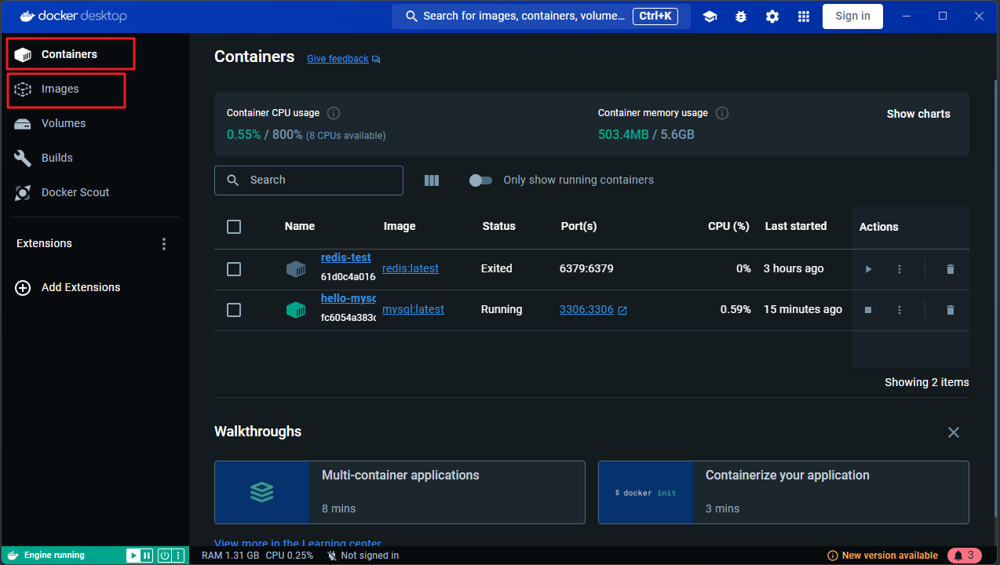
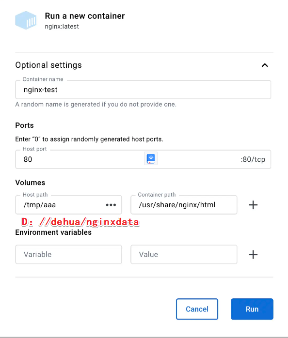
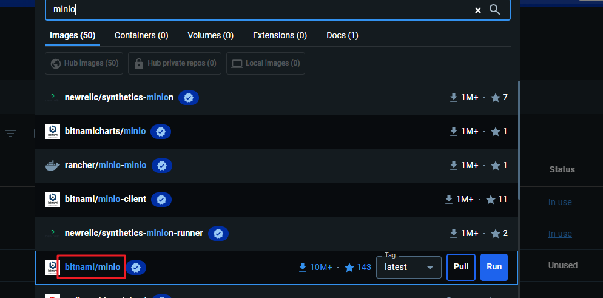
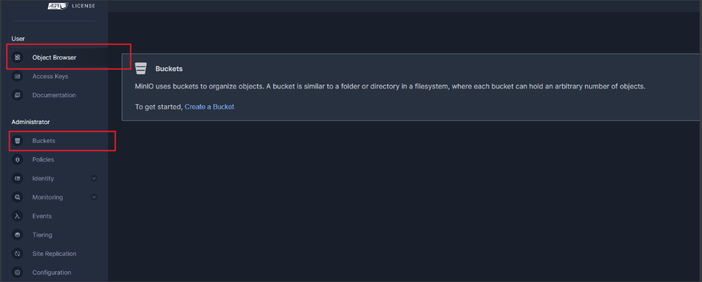
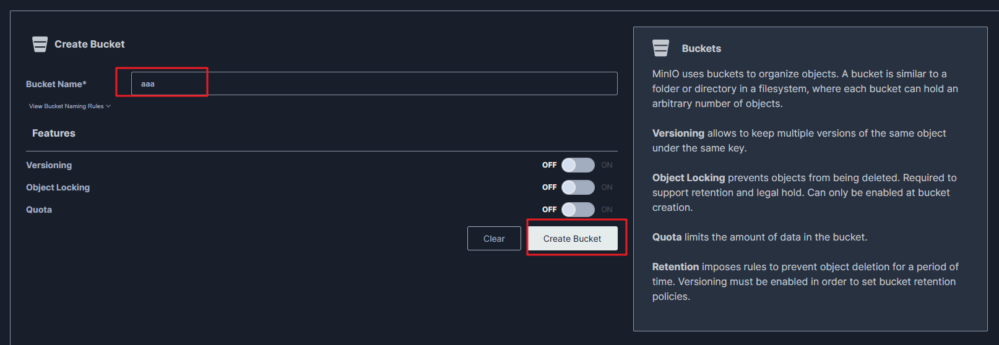
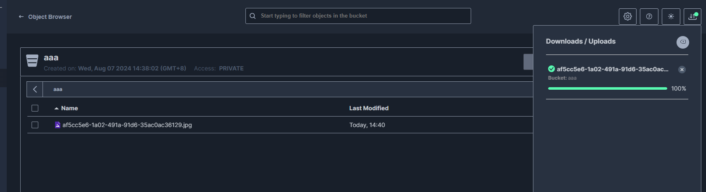

# 介绍

::: tip    什么是docker？

后端系统会部署很多服务，包括我们自己开发的服务，还有 mysql、redis 等中间件的服务，部署它们需要一系列依赖的安装、环境变量的设置等等。

如果你要部署多台机器的话，同样的操作要重复多次，万一哪一步漏掉了，服务就跑不起来了。就很麻烦。

而 Docker 就能完美解决这个问题：

它把系统的所有文件封装成一个镜像，镜像跑起来作为容器，它可以在一台机器上跑多个容器，每个容器都有独立的操作系统环境，比如文件系统、网络端口等，在容器内跑各种服务。

这样整个环境都保存在这个镜像里，部署多个实例只要通过这个镜像跑多个容器就行

:::

Docker 提供了 Docker Hub 镜像仓库，可以把本地镜像 push 到仓库或者从仓库 pull 镜像到本地

1. images 是本地的所有镜像
2. containers 是镜像跑起来的容器

docker desktop 可以可视化的管理它们，很方便

## nginx镜像

## minio镜像

name 是容器名。

port 是映射本地 9000 和 9001 端口到容器内的端口。

volume 是挂载本地目录到容器内的目录

这里挂载了一个本地一个目录到容器内的数据目录 /bitnami/minio/data，这样容器里的各种数据都保存在本地了。

还要指定两个环境变量，MINIO_ROOT_USER 和 MINIO_ROOT_PASSWORD，是用来登录的

这个 bucket 就是管理桶的地方，而 object browser 就是管理文件列表的地方。

创建一个Buckets

和阿里云 OSS 用法一样。

上传了一个文件

9000 查看图片

9001 客户端

http://localhost:9000/aaa/65b2c4cf66fb0_800.jpg   可以看到自己的文件了   

## docker命令

1. docker pull nginx:latest       相当于拉取镜像

2. docker run --name nginx-test2 -p 80:80 -v /tmp/aaa:/usr/share/nginx/html -e KEY1=VALUE1 -d nginx:latest   相当于上面的表单

   1. -p 是端口映射

      -v 是指定数据卷挂载目录

      -e 是指定环境变量

      -d 是后台运行

3. docker ps            获取正在运行的容器列表

4. docker ps  -a      获取全部容器列表

5. docker start：启动一个已经停止的容器

6. docker rm：删除一个容器

7. docker stop：停止一个容器

## 总结

Docker 可以把环境封装成镜像，镜像跑起来是一个独立的容器。通过这种方式可以快速部署多个相同的实例。

docker 提供了一个 desktop 工具，可以可视化的操作 docker，包括容器、镜像、volume 等

我们 pull 了一个 nginx 镜像下来，指定端口映射、挂载的数据卷，并把它跑起来了。

这就是 docker 的基本用法。

当然，这些可视化的操作都有对应的命令，当服务器上没有桌面的时候，就需要用命令行操作了。

不得不说，用 desktop 来学 docker 真是太简单了。