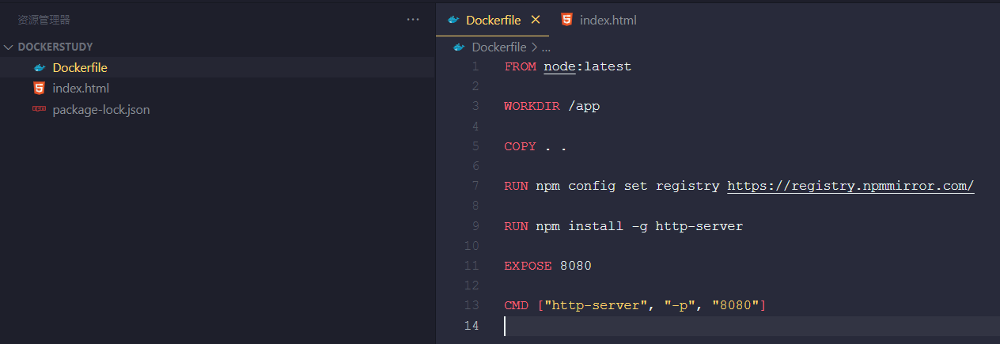
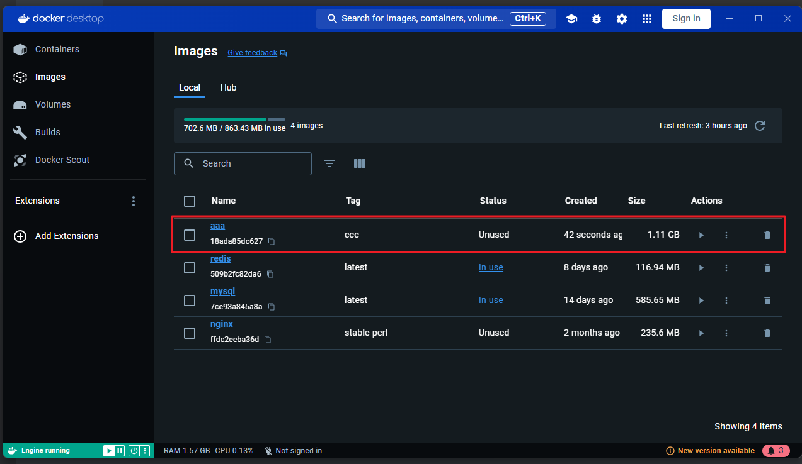
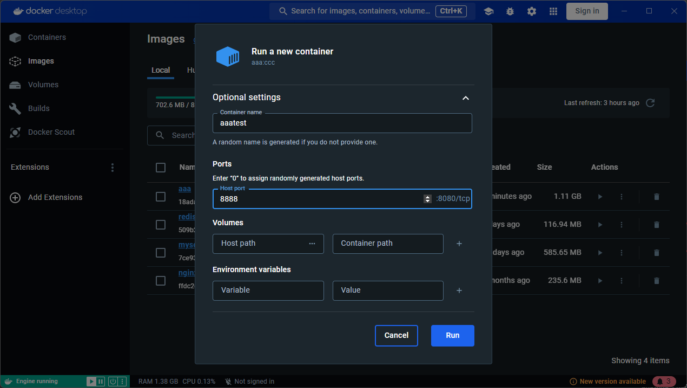
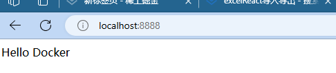
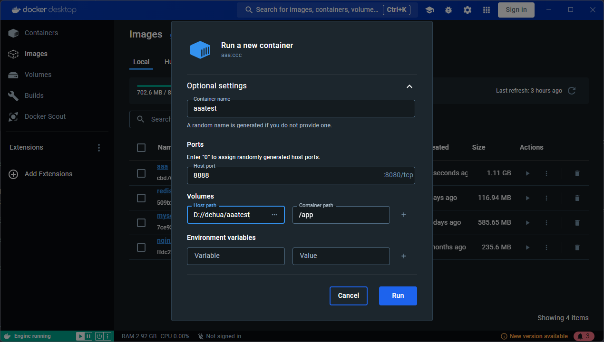

# 介绍

::: tip    自己制作一个这样的镜像，怎么做呢？

docker 容器内就是一个独立的系统环境，想想如果在这样一个系统上，要安装 nginx 服务，怎么做呢？

需要执行一些命令、复制一些文件进来，然后启动服务。

制作镜像自然也要进行这样的过程，不过可以自动化。

只要在 dockerfile 里声明要做哪些事情，docker build 的时候就会根据这个 dockerfile 来自动化构建出一个镜像来

::: 

## 例子

```dockerfile
FROM node:latest

WORKDIR /app

COPY . .

RUN npm config set registry https://registry.npmmirror.com/

RUN npm install -g http-server

EXPOSE 8080

CMD ["http-server", "-p", "8080"]

```

解释一下指令的含义

- FROM：基于一个基础镜像来修改

- WORKDIR：指定当前工作目录

- COPY：把容器外的内容复制到容器内

- RUN：在容器内执行命令

- EXPOSE：声明当前容器要访问的网络端口，比如这里起服务会用到 8080

- CMD：容器启动的时候执行的命令

  > 我们先通过 FROM 继承了 node 基础镜像，里面就有 npm、node 这些命令了。
  >
  > 通过 WORKDIR 指定当前目录。
  >
  > 然后通过 COPY 把 Dockerfile 同级目录下的内容复制到容器内，这里的 . 也就是 /app 目录
  >
  > 之后通过 RUN 执行 npm install，全局安装 http-server
  >
  > 通过 EXPOSE 指定要暴露的端口
  >
  > CMD 指定容器跑起来之后执行的命令，这里就是执行 http-server 把服务跑起来。
  >
  > 把这个文件保存为 Dockerfile，然后在同级添加一个 index.html

### 创建一下试试



```dockerfile
FROM node:latest

WORKDIR /app

COPY . .

RUN npm config set registry https://registry.npmmirror.com/

RUN npm install -g http-server

EXPOSE 8080

CMD ["http-server", "-p", "8080"]
```

```html
<!DOCTYPE html>
<html lang="en">

<head>
  <meta charset="UTF-8">
  <meta name="viewport" content="width=device-width, initial-scale=1.0">
  <title>Document</title>
</head>

<body>
  <div>Hello Docker</div>
</body>

</html>
```

### 生成镜像

```bash
docker build -t aaa:ccc .
```

aaa 是镜像名，ccc 是镜像的标签


FROM 是继承一个基础镜像，看输出也可以看出来，前面都是 node 镜像的内容，会一层层下载下来。

最后才是本地的我们添加的那些。

完事之后，我们就可以看见镜像了



运行一下试试看



输入8080端口看看



至此，我们写的第一个 dockerfile 和 build 出的第一个镜像就跑成功了！

## 挂载点

修改第一个例子，**进入容器内改太麻烦，不如把这个 /app 目录设置为挂载点**

```dockerfile
FROM node:latest

WORKDIR /app

COPY . .

RUN npm config set registry https://registry.npmmirror.com/

RUN npm install -g http-server

EXPOSE 8080

VOLUME /app          // 挂载点

CMD ["http-server", "-p", "8080"]

```

现在不是默认的 Dockerfile 了，需要用 -f 指定下 dockefile 的文件名

````bash
docker build -t aaa:ddd -f 2.Dockerfile .
````

运行一下这个镜像



完美 ！！！

**一定要声明了 volume 这样就能保证数据不丢失**

如果没有写

inspect 可以看到这时候的路径是一个临时的目录

设想下，如果你跑了个 mysql 容器，存了很多数据，但是跑容器的时候没指定数据卷。有一天，你把容器删了，所有数据都没了，可不可怕？

为了避免这种情况，mysql 的 dockerfile 里是必须声明 volume 的，这样就算你没通过 -v 指定数据卷，将来也可以找回数据

## 总结

docker 镜像是通过 dockerfile 构建出来的。

我们写了第一个 dockerfile，通过 FROM、WORKDIR、COPY、RUN、EXPOSE、CMD 等指令声明了一个 http-server 提供静态服务的镜像。

docker run 这个镜像就可以生成容器，指定映射的端口、挂载的数据卷、环境变量等。

VOLUME 指令看起来没啥用，但能保证你容器内某个目录下的数据一定会被持久化，能保证没挂载数据卷的时候，数据不丢失。

写完这个 dockerfile，相信你会对 docker 镜像、容器有更具体的理解了。

