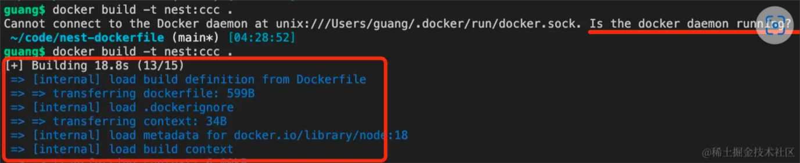
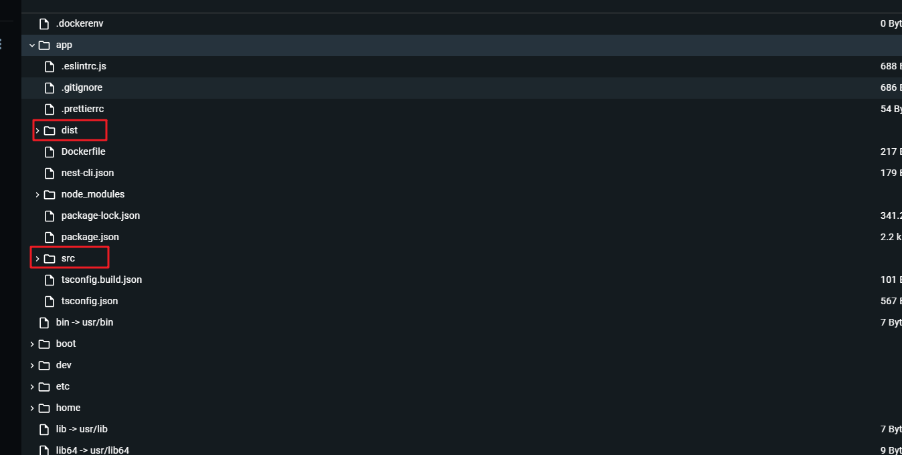
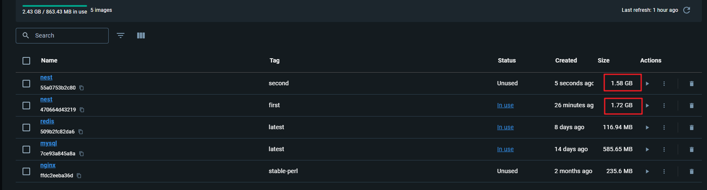
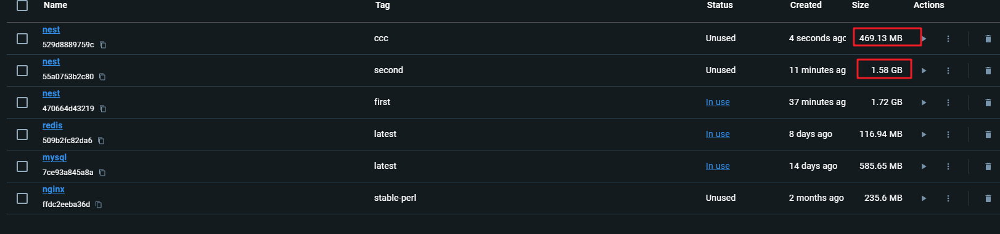

# 介绍

::: tip    dockerfile 是在哪里 build 的，在命令行工具里，还是在 docker 守护进程呢？

答案是在守护进程 docker daemon。

我没启动 docker daemon 的时候是不能 build 的，启动之后才可以：



::: 

## .dockerignore(排除哪些文件)

命令行工具会和 docker daemon 交互来实现各种功能。

比如 docker build 的时候，会把 dockerfile 和它的构建上下文（也就是所在目录）打包发送给 docker daemon 来构建镜像

比如我们会执行这样的命令：

```bash
docker build -t name:tag -f filename .
```

这个 . 就是构建上下文的目录，你也可以指定别的路径。

而镜像自然是越小性能越好，所以 docker 支持你通过 .dockerignore 声明哪些不需要发送给 docker daemon。

.dockerignore 是这样写的：

```json
# 这是一个注释
*.md
!README.md
node_modules/
[a-c].txt
.git/
.DS_Store
.vscode/
.dockerignore
.eslintignore
.eslintrc
.prettierrc
.prettierignore

```

*.md 就是忽略所有 md 结尾的文件，然后 !README.md 就是其中不包括 README.md

node_modules/ 就是忽略 node_modules 下 的所有文件

[a-c].txt 是忽略 a.txt、b.txt、c.txt 这三个文件

.DS_Store 是 mac 的用于指定目录的图标、背景、字体大小的配置文件，这个一般都要忽略

eslint、prettier 的配置文件在构建镜像的时候也用不到

**docker build 时，会先解析 .dockerignore，把该忽略的文件忽略掉，然后把剩余文件打包发送给 docker daemon 作为上下文来构建产生镜像。**

这就像你在 git add 的时候，.gitignore 下配置的文件也会被忽略一样。

忽略这些用不到的文件，是为了让构建更快、镜像体积更小。

此外，还有一种减小镜像体积的手段：多阶段构建。

## 没有使用多阶段构建

我们会先把源码目录发送到 docker daemon 中执行 npm run build 来构建产物，之后再 node ./dist/main.js 把服务跑起来

```bash
nest new dockerfile-test -p npm
```

编写 .dockerignore：

```dockerfile
*.md
node_modules/
.git/
.DS_Store
.vscode/
.dockerignore
```

编写 Dockerfile：

```dockerfile
FROM node:18

WORKDIR /app

COPY package.json .

RUN npm config set registry https://registry.npmmirror.com/

RUN npm install

COPY . .

RUN npm run build

EXPOSE 3000

CMD [ "node", "./dist/main.js" ]

```

基于 node 18 的镜像。

指定当前目录为容器内的 /app。

把 package.json 复制到容器里，设置淘宝的 npm registry，执行 npm install。

之后把其余的文件复制过去，执行 npm run build。

指定暴露的端口为 3000，容器跑起来以后执行 node ./dist/main.js 命令。

然后执行 docker build：

```
docker build -t nest:first .
```

这样我们就用 docker 把我们的 nest 应用跑起来了！

但现在 docker 镜像还是不完美的。

这样构建出来的镜像有什么问题呢？

明显，src 等目录就不再需要了，构建的时候需要这些，但运行的时候**只需要 dist 目录**就可以了。



把这些文件包含在内，会让镜像体积变大。

那怎么办呢？

构建两次么？第一次构建出 dist 目录，第二次再构建出跑 dist/main.js 的镜像。那不是要两个 dockerfile？

确实需要构建两次，但只需要一个 dockerfile 就可以搞定。

这需要用到 dockerfile 的多阶段构建的语法。

## 多阶段构建

```
# build stage
FROM node:18 as build-stage

WORKDIR /app

COPY package.json .

RUN npm config set registry https://registry.npmmirror.com/

RUN npm install

COPY . .

RUN npm run build

# production stage
FROM node:18 as production-stage

COPY --from=build-stage /app/dist /app
COPY --from=build-stage /app/package.json /app/package.json

WORKDIR /app

RUN npm config set registry https://registry.npmmirror.com/

RUN npm install --production

EXPOSE 3000

CMD ["node", "/app/main.js"]

```

通过 FROM 继承镜像的时候，给当前镜像指定一个名字，比如 build-stage。

然后第一个镜像执行 build。

之后再通过 FROM 继承 node 镜像创建一个新镜像。

通过 COPY --from-build-stage 从那个镜像内复制 /app/dist 的文件到当前镜像的 /app 下。

还要把 package.json 也复制过来，然后切到 /app 目录执行 npm install --production 只安装 dependencies 依赖

这个生产阶段的镜像就指定容器跑起来执行 node /app/main.js 就好了。

执行 docker build，打上 second 标签

````bash
docker build -t nest:second .
````



可以看到小了很多

但现在镜像依然很大呀，那是因为我们用的基础的 linux 镜像比较大，可以换成 alpine 的，这是一个 linux 发行版，主打的就是一个体积小

## alpine   （高山植物  很贴合体积小的含义 ）

是一种高山植物，就是很少的养分就能存活，很贴合体积小的含义

```dockerfile
FROM node:18.0-alpine3.14 as build-stage

WORKDIR /app

COPY package.json .

RUN npm config set registry https://registry.npmmirror.com/

RUN npm install

COPY . .

RUN npm run build

# production stage
FROM node:18.0-alpine3.14 as production-stage

COPY --from=build-stage /app/dist /app
COPY --from=build-stage /app/package.json /app/package.json

WORKDIR /app

RUN npm config set registry https://registry.npmmirror.com/

RUN npm install --production

EXPOSE 3000

CMD ["node", "/app/main.js"]

```

node:18-alpine3.14 就是用 alpine 的 linux 的 3.14 版本，用 node 的 18.0 版本

````bash
docker build -t nest:ccc .
````



## 总结

docker build 的时候会把构建上下文的所有文件打包发送给 docker daemon 来构建镜像。

可以通过 .dockerignore 指定哪些文件不发送，这样能加快构建时间，减小镜像体积。

此外，多阶段构建也能减小镜像体积，也就是 build 一个镜像、production 一个镜像，最终保留下 production 的镜像。

而且我们一般使用 alpine 的基础镜像，类似 node:18.10-alpine3.14，这样构建出来镜像体积会小很多。

这就是用 Nest 项目构建 Docker 镜像的方式。