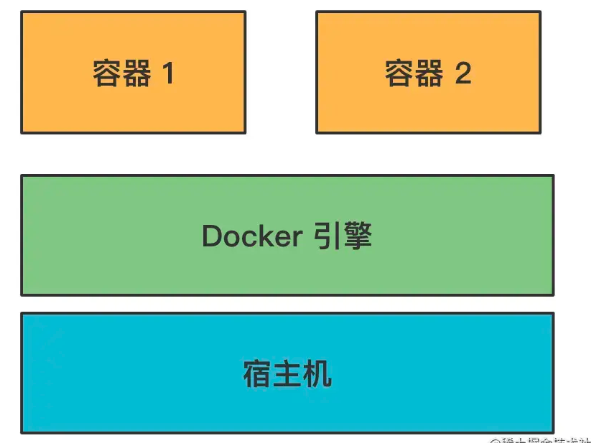
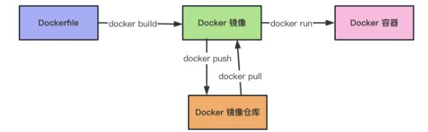
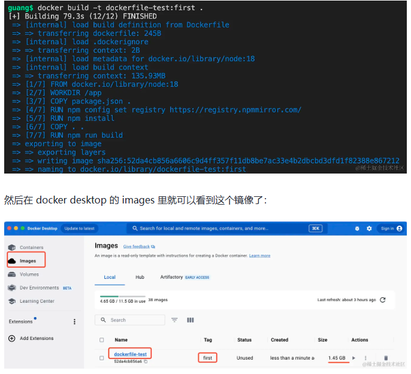
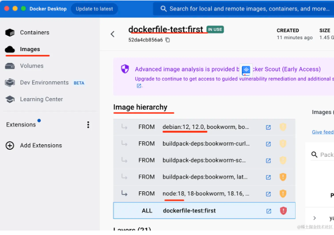
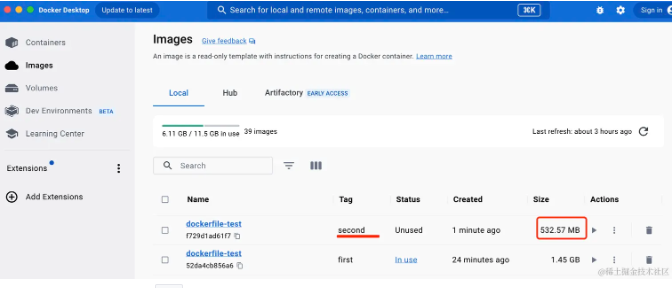
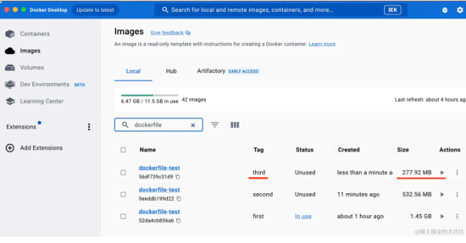
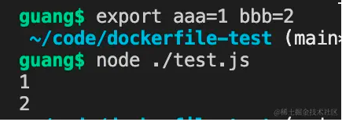
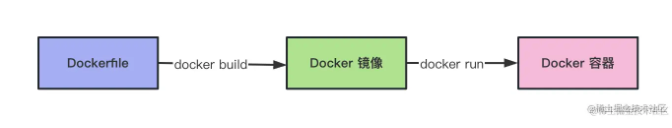

# 介绍

::: tip    提升

5个技巧，提高我们编写dockerfile的水平

::: 

Docker 是一种容器技术，它可以在操作系统上创建多个相互隔离的容器。容器内独立安装软件、运行服务



但是，这个容器和宿主机还是有关联的，比如可以把宿主机的端口映射到容器内的端口、宿主机某个目录挂载到容器内的目录


比如映射了 3000 端口，那容器内 3000 端口的服务，就可以在宿主机的 3000 端口访问了。

比如挂载了 /aaa 到容器的 /bbb/ccc，那容器内读写 /bbb/ccc 目录的时候，改的就是宿主机的 /aaa 目录，反过来，改宿主机 /aaa 目录，容器内的 /bbb/ccc 也会改，这俩同一个。

这分别叫做端口映射、数据卷（volume）挂载。

这个容器是通过镜像起来的，通过 docker run image-name

```
docker run -p 3000:3000 -v /aaa:/bbb/ccc --name xxx-container xxx-image
```

通过 xxx-image 镜像跑起来一个叫做 xxx-container 的容器。

-p 指定端口映射，映射宿主机的 3000 到容器的 3000 端口。

-v 指定数据卷挂载，挂载宿主机的 /aaa 到容器的 /bbb/ccc 目录。

这个镜像是通过 Dockerfile 经过 build 产生的。

也就是这样的流程：



一般在项目里维护 Dockerfile ，然后执行 docker build 构建出镜像、push 到镜像仓库，部署的时候 pull 下来用 docker run 跑起来。

基本 CI/CD 也是这样的流程：

CI 的时候 git clone 项目，根据 dockerfile 构建出镜像，打上 tag，push 到仓库。

CD 的时候把打 tag 的镜像下下来，docker run 跑起来。

这个 Dockerfile 是在项目里维护的，虽然 CI/CD 流程不用自己搞，但是 Dockefile 还是要开发者自己写的。

## 比如创建 nest 项目

```bash
npx nest new dockerfile-test -p npm

npm run build

node ./dist/main.js

```

来写应该dockerfile

```
FROM node:18

WORKDIR /app

COPY package.json .

COPY *.lock .

RUN npm config set registry https://registry.npmmirror.com/

RUN npm install

COPY . .

RUN npm run build

EXPOSE 3000

CMD [ "node", "./dist/main.js" ]

```

FROM node:18 是继承 node:18 基础镜像。

WORKDIR /app 是指定当前目录为 /app

COPY 复制宿主机的 package.json 和 lock 文件到容器的当前目录，也就是 /app 下

RUN 是执行命令，这里执行了 npm install。

然后再复制其余的文件到容器内。

EXPOSE 指定容器需要暴露的端口是 3000。

CMD 指定容器跑起来时执行的命令是 node ./dist/main.js。

然后通过 docker build 把它构建成镜像：

```bash
docker build -t dockerfile-test:first .
```

-t 是指定名字和标签，这里镜像名为 dockerfile-test 标签为 first



就是现在镜像稍微大了点，有 1.45 G

跑起来看看

```bash
docker run -d -p 2333:3000 --name first-container dockerfile-test:first
```

-d 是后台运行。

-p 指定端口映射，映射宿主机的 2333 端口到容器的 3000 端口。

--name 指定容器名

## 一 使用 alpine 镜像，而不是默认的 linux 镜像

docker 容器内跑的是 linux 系统，各种镜像的 dockerfile 都会继承 linux 镜像作为基础镜像。

比如我们刚刚创建的那个镜像，点开详情可以看到它的镜像继承关系：



最终还是继承了 debian 的 Linux 镜像，这是一个 linux 发行版

但其实这个 linux 镜像可以换成更小的版本，也就是 alpine

它裁剪了很多不必要的 linux 功能，使得镜像体积大幅减小了

```dockerfile
#修改成alpine 镜像
FROM node:18-alpine33.14 

WORKDIR /app

COPY package.json .

COPY *.lock .

RUN npm config set registry https://registry.npmmirror.com/

RUN npm install

COPY . .

RUN npm run build

EXPOSE 3000

CMD [ "node", "./dist/main.js" ]
```

node:18-alpine3.14 是使用 18 版本的 node 镜像，它底层使用 alpine 3.14 的基础镜像

然后 docker build

```bash
docker build -t dockerfile-test:second .
```

好家伙，足足小了 900M



小了这么多，这对吗？

跑一下试试

```bash
docker run -d -p 2334:3000 --name second-container dockerfile-test:second
```

alpine 只是去掉了很多 linux 里用不到的功能，使得镜像体积更小

这就是第一个技巧

## 二 使用多阶段构建

### 为什么拷贝这么多次？

```dockerfile
#修改成alpine 镜像
FROM node:18-alpine33.14 

WORKDIR /app

COPY package.json .   #拷贝 package.json

COPY *.lock .         #拷贝 *.lock .

RUN npm config set registry https://registry.npmmirror.com/

RUN npm install

COPY . .             #拷贝全部

RUN npm run build

EXPOSE 3000

CMD [ "node", "./dist/main.js" ]
```

为什么先复制 package.json 进去，安装依赖之后再复制其他文件，直接全部复制进去不就行了？

不是的，这两种写法的效果不同。

docker 是**分层存储**的，dockerfile 里的**每一行指令是一层**，会做**缓存**。

每次 docker build 的时候，只会**从变化的层开始重新构建**，没变的层会直接复用。

也就说现在这种写法，如果 package.json 没变，那么就不会执行 npm install，直接复用之前的。

那如果一开始就把所有文件复制进去呢？

那不管 package.json 变没变，任何一个文件变了，都会重新 npm install，这样没法充分利用缓存，性能不好。

这就是为什么要单独写这么多拷贝的意思了

### 为什么使用多阶段构建？

问题就是源码和很多构建的依赖是不需要的，但是现在都保存在了镜像里。

实际上我们只需要构建出来的 ./dist 目录下的文件还有运行时的依赖。

```dockerfile
FROM node:18-alpine3.14 as build-stage

WORKDIR /app

COPY package.json .

RUN npm config set registry https://registry.npmmirror.com/

RUN npm install

COPY . .

RUN npm run build

# production stage
FROM node:18-alpine3.14 as production-stage

COPY --from=build-stage /app/dist /app
COPY --from=build-stage /app/package.json /app/package.json

WORKDIR /app

RUN npm config set registry https://registry.npmmirror.com/

RUN npm install --production

EXPOSE 3000

CMD ["node", "/app/main.js"]

```

FROM 后面添加一个 as 来指定当前构建阶段的名字。

通过 COPY --from=xxx 可以从上个阶段复制文件过来。

然后 npm install 的时候添加 --production，这样只会安装 dependencies 的依赖。

docker build 之后，只会留下最后一个阶段的镜像。

也就是说，最终构建出来的镜像里是没有源码的，有的只是 dist 的文件和运行时依赖。

这样镜像就会小很多。

```bash
docker build -t dockerfile-test:third -f 222.Dockerfile .
```

标签为 third。

-f 是指定 Dockerfile 的名字



镜像体积比没有用多阶段构建的时候小了 250 M

这就是第二个技巧，多阶段构建

## 三  使用 ARG 增加构建灵活性

写一个 test.js

打印了环境变量 aaa、bbb

```
console.log(process.env.aaa);
console.log(process.env.bbb);
```

```
export aaa=1 bbb=2
node ./test.js
```



然后我们写个 dockerfile，文件名是 333.Dockerfile：

```js
FROM node:18-alpine3.14

ARG aaa
ARG bbb

WORKDIR /app

COPY ./test.js .

ENV aaa=${aaa} \
    bbb=${bbb}

CMD ["node", "/app/test.js"]

```

使用 ARG 声明构建参数，使用 ${xxx} 来取

然后用 ENV 声明环境变量。

dockerfile 内换行使用 \

之后构建的时候传入构建参数：

```bash
docker build --build-arg aaa=3 --build-arg bbb=4 -t arg-test -f 333.Dockerfile .
```

然后跑起来：

```
docker run  --name fourth-container arg-test
```

可以看到容器内拿到的环境变量就是 ENV 设置的。

也就是说 ARG 是构建时的参数，ENV 时运行时的变量。

灵活使用 ARG，可以增加 dockerfile 的灵活性。

这就是第三个技巧

## 四 CMD 结合 ENTRYPOINT

重点是用 CMD 的时候，启动命令是可以重写的,可以替换成任何命令

```
docker run cmd-test echo "东东"
```

而用 ENTRYPOINT 就不会

```
docker run cmd-test echo "东东"
```

可以看到，现在 dockerfile 里 ENTRYPOINT 的命令依然执行了。

docker run 传入的参数作为了 echo 的额外参数。

这就是 ENTRYPOINT 和 CMD 的区别。

一般还是 CMD 用的多点，可以灵活修改启动命令

这是第四个技巧。

## 五 COPY &ADD

这俩都可以把宿主机的文件复制到容器内。

但有一点区别，就是对于 tar.gz 这种压缩文件的处理上：

也就是说，ADD、COPY 都可以用于把目录下的文件复制到容器内的目录下。

但是 ADD 还可以解压 tar.gz 文件。

一般情况下，还是用 COPY 居多。

```dockerfile
ADD ./aaa.tar.gz /aaa

COPY ./aaa.tar.gz /bbb
```

## 介绍

Docker 是流行的容器技术，它可以在操作系统上创建多个隔离的容器，在容器内跑各种服务。

它的流程是 Dockerfile 经过 docker build 生成 docker 镜像，然后 docker run 来跑容器。



docker run 的时候可以通过 -p 指定宿主机和容器的端口映射，通过 -v 挂载数据卷到容器内的某个目录。

CI/CD 基本也是这套流程，但是 Dockerfile 是要开发者自己维护的。

Dockerfile 有挺多技巧：

- 使用 alpine 的镜像，而不是默认的 linux 镜像，可以极大减小镜像体积，比如 node:18-alpine3.14 这种
- 使用多阶段构建，比如一个阶段来执行 build，一个阶段把文件复制过去，跑起服务来，最后只保留最后一个阶段的镜像。这样使镜像内只保留运行需要的文件以及 dependencies。
- 使用 ARG 增加构建灵活性，ARG 可以在 docker build 时通过 --build-arg xxx=yyy 传入，在 dockerfile 中生效，可以使构建过程更灵活。如果是想定义运行时可以访问的变量，可以通过 ENV 定义环境变量，值使用 ARG 传入。
- CMD 和 ENTRYPOINT 都可以指定容器跑起来之后运行的命令，CMD 可以被覆盖，而 ENTRYPOINT 不可以，两者结合使用可以实现参数默认值的功能。
- ADD 和 COPY 都可以复制文件到容器内，但是 ADD 处理 tar.gz 的时候，还会做一下解压。

灵活使用这些技巧，可以让你的 Dockerfile 更加灵活、性能更好。

