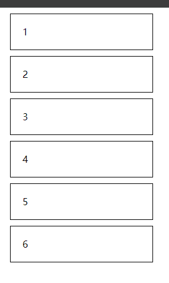
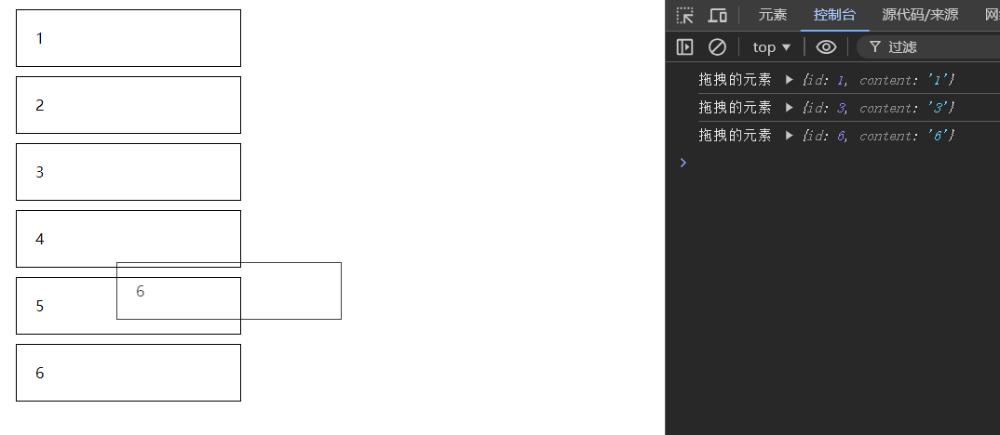

# 介绍

做一个列表拖拽排序

## 搭建环境

```bash
npx create-react-app --template=typescript react-dnd-test

npm install react-dnd react-dnd-html5-backend
```

## 初始化项目

实现的效果



```tsx
//App.tsx
import React, { useState } from 'react'

interface CardItem {
  id: number
  content: string
}

interface CardProps {
  data: CardItem
}

function Card(props: CardProps) {
  const { data } = props

  return (
    <div>
      <div className="card">{data.content}</div>
    </div>
  )
}

export default function App() {
  const [item, setItem] = useState<any>([
    {
      id: 1,
      content: '1',
    },
    {
      id: 2,
      content: '2',
    },
    ,
    {
      id: 3,
      content: '3',
    },
    ,
    {
      id: 4,
      content: '4',
    },
    ,
    {
      id: 5,
      content: '5',
    },
    ,
    {
      id: 6,
      content: '6',
    },
  ])

  return (
    <div className="card-list">
      {item.map((item: CardItem) => (
        <Card data={item} key={'card_' + item.id} />
      ))}
    </div>
  )
}
```

```css
//index.css
.card {
  width: 200px;
  line-height: 60px;
  padding: 0 20px;
  border: 1px solid #000;
  margin: 10px;
  cursor: move;
}
```

```tsx
//index.tsx
import ReactDOM from 'react-dom/client'
import './index.css'
import App from './App'

// 拖拽
import { DndProvider } from 'react-dnd'
import { HTML5Backend } from 'react-dnd-html5-backend'

const root = ReactDOM.createRoot(document.getElementById('root') as HTMLElement)
root.render(
  <DndProvider backend={HTML5Backend}>
    <App />
  </DndProvider>
)
```

##  实现可拖拽

这个拖拽就和第一节是不一样了

不一样的地方在  元素本身，即是可拖动的元素，也是存放拖动元素区域

来吧，对card组件。进行改造把，需要使用，**useRef**   **useDrop**



```tsx
function Card(props: CardProps) {
  const { data } = props
  const ref = useRef(null)
  const [, drag] = useDrag({
    type: 'card',
    item: data,
  })
  const [, drop] = useDrop({
    accept: 'card',
    drop: (item) => {
      console.log('拖拽的元素', item)
    },
  })

  useEffect(() => {
    drag(ref)
    drop(ref)
  }, [])

  return (
    <div>
      <div className="card" ref={ref}>
        {data.content}
      </div>
    </div>
  )
}
```

这时候，就实现了元素可以移动了，并且会触发拖动的事件

## 实现交换位置

改造组件，传递当前组件的index，和修改位置的方法给Card组件

```tsx
 export default function App() {
  const [item, setItem] = useState<any>([
    {
      id: 1,
      content: '1',
    },
    {
      id: 2,
      content: '2',
    },
    ,
    {
      id: 3,
      content: '3',
    },
    ,
    {
      id: 4,
      content: '4',
    },
    ,
    {
      id: 5,
      content: '5',
    },
    ,
    {
      id: 6,
      content: '6',
    },
  ])

  const swapIndex = useCallback((index1: number, index2: number) => {
    const tmp = item[index1]
    item[index1] = item[index2]
    item[index2] = tmp
    setItem([...item])
  }, [])

  return (
    <div className="card-list">
      {item.map((item: CardItem, index: number) => (
        <Card data={item} key={item.id} index={index} swapIndex={swapIndex} />
      ))}
    </div>
  )
}
```

