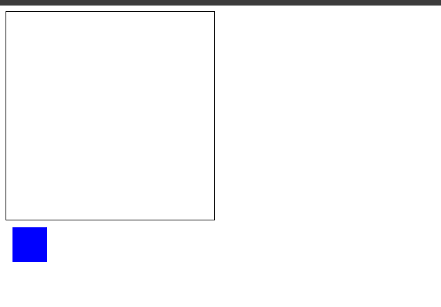

# 介绍

## 环境搭建

```bash
npx create-react-app --template=typescript react-dnd-test

npm install react-dnd react-dnd-html5-backend
```

## 搭建基本环境

就是单纯的两个盒子



```tsx
//App.tsx
import './App.css';

function Box() {
  return <div className='box'></div>
}

function Container() {
  return <div className="container"></div>
}

function App() {
  return <div>
    <Container></Container>
    <Box></Box>
  </div>
}

export default App;

```

```css
//index.css
.box {
  width: 50px;
  height: 50px;
  background: blue;
  margin: 10px;
}

.container {
  width: 300px;
  height: 300px;
  border: 1px solid #000;
}
```

