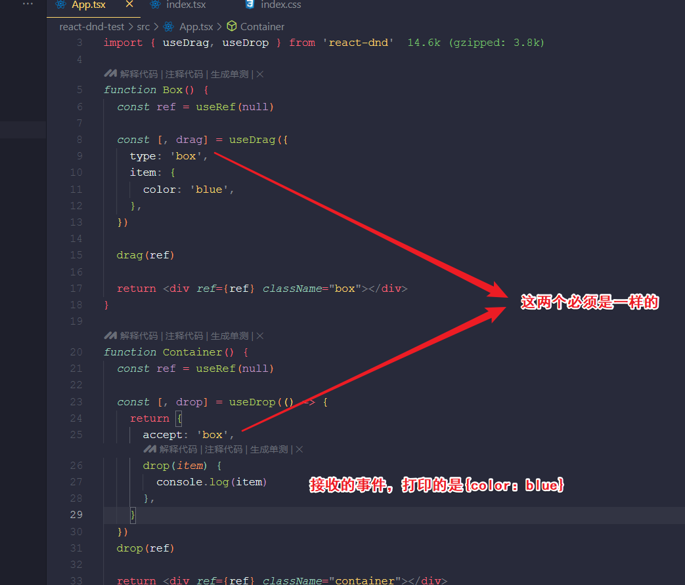
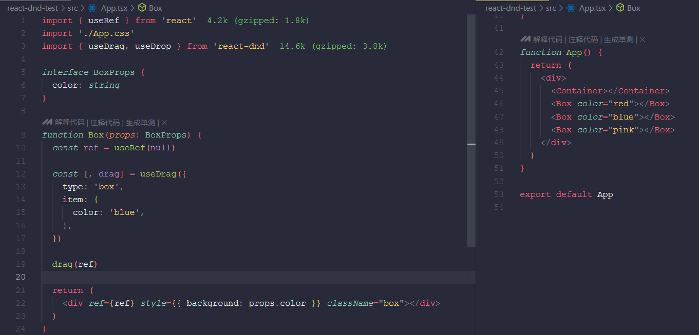
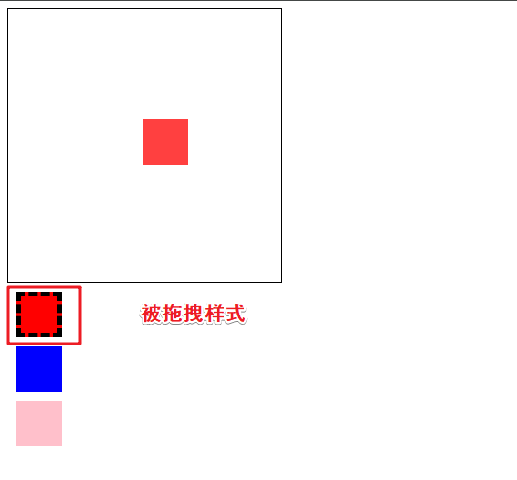
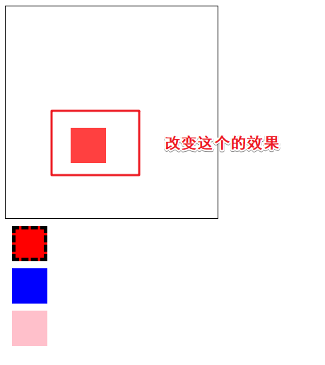
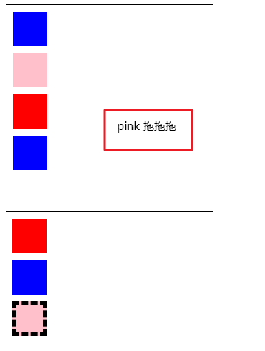
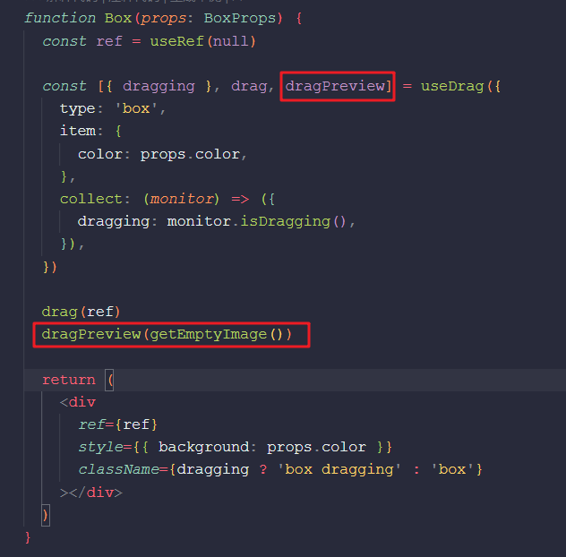

# 介绍

<video width="320" height="240" controls>     <source src="../../../public/dnd22.mp4" type="video/mp4">     Your browser does not support the video tag.   </video>

::: danger

- 使用 useDrag 处理拖拽的元素，使用 useDrop 处理 drop 的元素，使用 useDragLayer 处理自定义预览元素
- 在根组件使用 DndProvider 设置 context 来传递数据
- useDrag 可以传入 type、item、collect 等。type 标识类型，同类型才可以 drop。item 是传递的数据。collect 接收 monitor，可以取拖拽的状态比如 isDragging 返回。
- useDrag 返回三个值，第一个值是 collect 函数返回值，第二个是处理 drag 的元素的函数，第三个值是处理预览元素的函数
- useDrop 可以传入 accept、drop 等。accept 是可以 drop 的类型。drop 回调函数可以拿到 item，也就是 drag 元素的数据
- useDragLayer 的回调函数会传入 monitor，可以拿到拖拽的实时坐标，用来设置自定义预览效果

:::

## 搭建环境

```bash
npx create-react-app --template=typescript react-dnd-test

npm install react-dnd react-dnd-html5-backend
```

## 初始化项目


```tsx
//App.tsx
import './App.css';

function Box() {
  return <div className='box'></div>
}

function Container() {
  return <div className="container"></div>
}

function App() {
  return <div>
    <Container></Container>
    <Box></Box>
  </div>
}

export default App;

```

```css
//index.css
.box {
  width: 50px;
  height: 50px;
  background: blue;
  margin: 10px;
}

.container {
  width: 300px;
  height: 300px;
  border: 1px solid #000;
}

```

```tsx
import ReactDOM from 'react-dom/client'
import './index.css'
import App from './App'

// 拖拽
import { DndProvider } from 'react-dnd'
import { HTML5Backend } from 'react-dnd-html5-backend'

const root = ReactDOM.createRoot(document.getElementById('root') as HTMLElement)
root.render(
  <DndProvider backend={HTML5Backend}>
    <App />
  </DndProvider>
)

```

## 简单认识  useDrag      useDrop	 

box 部分用 useDrag 让元素可以拖拽：

```tsx
function Box() {
  const ref = useRef(null);

  const [, drag]= useDrag({
    type: 'box',
    item: {
      color: 'blue'
    }
  });

  drag(ref);

  return <div ref={ref} className='box'></div>
}
```

用 useDrop 让它可以接受拖拽过来的元素:

```tsx
function Container() {
  const ref = useRef(null);

  const [,drop] = useDrop(() => {
    return {
      accept: 'box',
      drop(item) {
        console.log(item);
      }
    }
  });
  drop(ref);

  return <div ref={ref} className="container"></div>
}
```

### 注意点



如果这两个类型不一样，是不会出发drop事件的

## 实现拖拽

简单封装box

```tsx
interface BoxProps {
  color: string
}

function Box(props: BoxProps) {
  const ref = useRef(null)

  const [, drag] = useDrag({
    type: 'box',
    item: {
      color: props.color,
    },
  })

  drag(ref)

  return (
    <div ref={ref} style={{ background: props.color }} className="box"></div>
  )
}
```



改下 Container 组件，增加一个 boxes 数组的 state，在 drop 的时候把 item 加到数组里，并触发渲染：

```tsx
function Container() {
  const ref = useRef(null)

  const [color, setColor] = useState<any>([])

  const [, drop] = useDrop(() => {
    return {
      accept: 'box',
      drop(item: any) {
        console.log(item)
        setColor((boxes: any) => {
          return [...boxes, item]
        })
      },
    }
  })
  drop(ref)

  return (
    <div ref={ref} className="container">
      {color.map((item: any, index: any) => {
        return <Box key={index} color={item.color}></Box>
      })}
    </div>
  )
}
```

这个时候就实现了一个简单的拖拽

<video width="320" height="240" controls>     <source src="../../../public/dnd11.mp4" type="video/mp4">     Your browser does not support the video tag.   </video>

## 拖拽过程（被拖拽元素的效果）

useDrag 可以传一个 collect 的回调函数，它的参数是 monitor，可以拿到拖拽过程中的状态。

collect 的返回值会作为 useDrag 的返回的第一个值。

我们判断下，如果是在 dragging 就设置一个 dragging 的 className。



```tsx
interface BoxProps {
  color: string
}

function Box(props: BoxProps) {
  const ref = useRef(null)

  const [{ dragging }, drag] = useDrag({
    type: 'box',
    item: {
      color: props.color,
    },
    collect: (monitor) => ({
      dragging: monitor.isDragging(),
    }),
  })

  drag(ref)

  return (
    <div
      ref={ref}
      style={{ background: props.color }}
      className={dragging ? 'box dragging' : 'box'}
    ></div>
  )
}
```

```css
.box {
  width: 50px;
  height: 50px;
  background: blue;
  margin: 10px;
}
.dragging {
  border: 5px dashed #000;
  box-sizing: border-box;
}

.container {
  width: 300px;
  height: 300px;
  border: 1px solid #000;
}
```

## 改变拖拽元素的预览效果

新建个组件

useDragLayer 的参数是函数，能拿到 monitor，从中取出很多东西，比如 item、isDragging，还是有 clientOffset，也就是拖拽过程中的坐标

其中 drag-layer 的样式如下：

```
.drag-layer {
  position: fixed;
}
```




```tsx
// 预览
const DragLayer = () => {
  const { isDragging, item, currentOffset } = useDragLayer((monitor) => ({
    item: monitor.getItem(),
    isDragging: monitor.isDragging(),
    currentOffset: monitor.getSourceClientOffset(),
  }))

  if (!isDragging) {
    return null
  }
  return (
    <div
      className="drag-layer"
      style={{
        left: currentOffset?.x,
        top: currentOffset?.y,
      }}
    >
      {item.color} 拖拖拖
    </div>
  )
}


function App() {
  return (
    <div>
      <Container></Container>
      <Box color="red"></Box>
      <Box color="blue"></Box>
      <Box color="pink"></Box>
      <DragLayer></DragLayer>  //使用一下 
    </div>
  )
}
```


## 去掉原先的预览效果

useDrag 的第三个参数就是处理预览元素的，我们用 getEmptyImage 替换它，就看不到了





```tsx
function Box(props: BoxProps) {
  const ref = useRef(null)

  const [{ dragging }, drag, dragPreview] = useDrag({
    type: 'box',
    item: {
      color: props.color,
    },
    collect: (monitor) => ({
      dragging: monitor.isDragging(),
    }),
  })

  drag(ref)
  dragPreview(getEmptyImage())

  return (
    <div
      ref={ref}
      style={{ background: props.color }}
      className={dragging ? 'box dragging' : 'box'}
    ></div>
  )
}
```

## 细节处理

```tsx
useEffect(() => {
    drag(ref);
    dragPreview(getEmptyImage(), { captureDraggingState: true });
}, [])

useEffect(()=> {
    drop(ref);
}, []);
```

## 全部代码

```tsx
//App.tsx
import { useRef, useState } from 'react'
import './App.css'
import { useDrag, useDragLayer, useDrop } from 'react-dnd'
import { getEmptyImage } from 'react-dnd-html5-backend'

interface BoxProps {
  color: string
}

function Box(props: BoxProps) {
  const ref = useRef(null)

  const [{ dragging }, drag, dragPreview] = useDrag({
    type: 'box',
    item: {
      color: props.color,
    },
    collect: (monitor) => ({
      dragging: monitor.isDragging(),
    }),
  })

  drag(ref)
  dragPreview(getEmptyImage())

  return (
    <div
      ref={ref}
      style={{ background: props.color }}
      className={dragging ? 'box dragging' : 'box'}
    ></div>
  )
}

function Container() {
  const ref = useRef(null)

  const [color, setColor] = useState<any>([])

  const [, drop] = useDrop(() => {
    return {
      accept: 'box',
      drop(item: any) {
        console.log(item)
        setColor((boxes: any) => {
          return [...boxes, item]
        })
      },
    }
  })
  drop(ref)

  return (
    <div ref={ref} className="container">
      {color.map((item: any, index: any) => {
        return <Box key={index} color={item.color}></Box>
      })}
    </div>
  )
}

// 预览
const DragLayer = () => {
  const { isDragging, item, currentOffset } = useDragLayer((monitor) => ({
    item: monitor.getItem(),
    isDragging: monitor.isDragging(),
    currentOffset: monitor.getSourceClientOffset(),
  }))

  if (!isDragging) {
    return null
  }
  return (
    <div
      className="drag-layer"
      style={{
        left: currentOffset?.x,
        top: currentOffset?.y,
      }}
    >
      {item.color} 拖拖拖
    </div>
  )
}

function App() {
  return (
    <div>
      <Container></Container>
      <Box color="red"></Box>
      <Box color="blue"></Box>
      <Box color="pink"></Box>
      <DragLayer></DragLayer>
    </div>
  )
}

export default App

```

```css
//index.css文件
.box {
  width: 50px;
  height: 50px;
  background: blue;
  margin: 10px;
}
.dragging {
  border: 5px dashed #000;
  box-sizing: border-box;
}

.container {
  width: 300px;
  height: 300px;
  border: 1px solid #000;
}

.drag-layer {
  position: fixed;
}

```

```tsx
//index.tsx
import ReactDOM from 'react-dom/client'
import './index.css'
import App from './App'

// 拖拽
import { DndProvider } from 'react-dnd'
import { HTML5Backend } from 'react-dnd-html5-backend'

const root = ReactDOM.createRoot(document.getElementById('root') as HTMLElement)
root.render(
  <DndProvider backend={HTML5Backend}>
    <App />
  </DndProvider>
)
```


