# 介绍

::: danger

:::

## 一  安装

[Git - Downloads (git-scm.com)](https://git-scm.com/downloads)

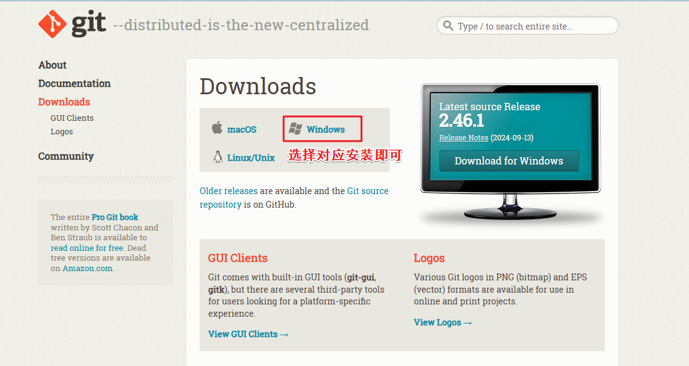

安装完毕  git -v  可以查看一下

windows电脑安装完成之后，鼠标右键

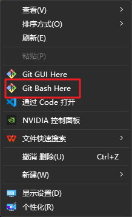

点击进去  输入

git --version

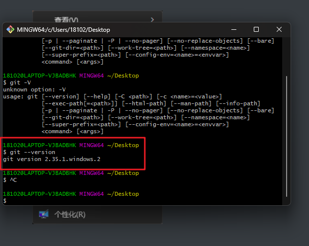

## 二 配置

配置用户名字和邮箱

1. 有三个参数
   1. 省略（Local）： 本地配置 ，只对本地仓库生效
   2. --global ： 全局配置，对所有仓库都生效
   3. --system： 系统配置 ，对所有用户生效

```bash
git config --global  user.name "xxxxxx"    //配置用户名

git config --global user.email  xxxxxxxxxxxxxxxxx   //配置邮箱

git config --global --list    //查看当前配置

```

##  初始化仓库

::: danger  基本命令

git  init     (初始化项目)

:::

### git  init  //初始化仓库

::: danger  创建仓库有两种方式

一种是 本地初始化

一种是直接拉取远程仓库

:::

```bash
git  init  //初始化仓库
```

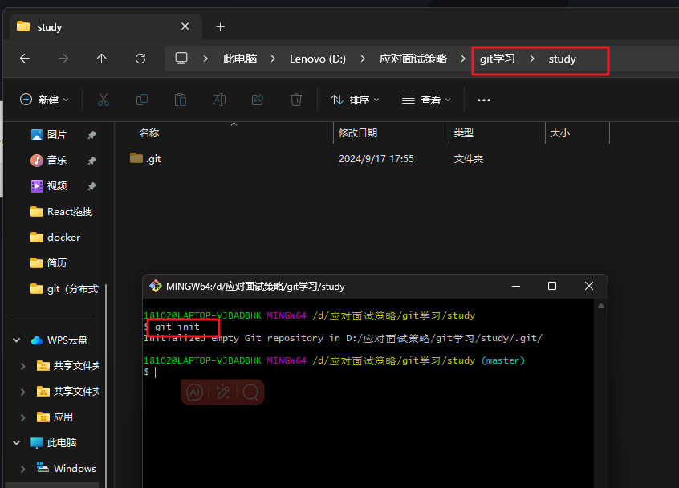

需要注意的地方 

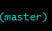

#### 注意

注意这个地方  默认的主分支  是最重要的分支    **master**分支也是所谓的**main**分支

## 工作区域

::: danger  分成大概三个状态

1. 工作区 （Working Directory） ： 本地的代码编写，也就是工作区域
2. 暂存区 (Staging Area/index)    ：暂存区  中间层  分成重要
3. 本地仓库(Local Repository)     :  就是通过git init 命令创建的仓库

工作区 ---------------->暂存区----------------->>本地仓库

​				git add  ----------->git commit  -m "xxx描述" 

:::

## 文件状态

::: danger   文件状态分成4个状态

1. 未跟踪  （git  status   文件状态是红色就是没有被追踪的）
2. 未修改
3. 已修改
4. 已暂存

相关命令

```bash
git  status       //查看文件状态
git  add  .       //提交文件暂存区
git commit  -m  ""  //提交到仓库（真正的被保管起来，只会把暂存区的文件提交到仓库）
```

:::

演示一下吧  在我们的初始化仓库的目录下 创建几个文件吧

我创建了四个文件

### 未跟踪

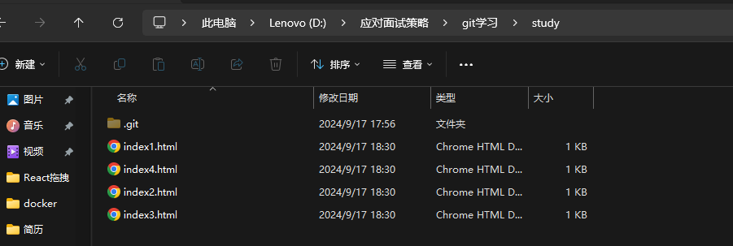

```bash
git status   //查看仓库状态
```

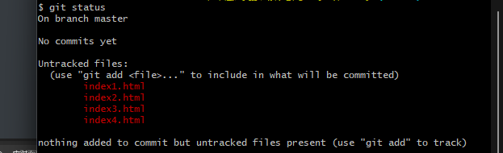

红色  什么意思呢  就是没有被跟踪的文件

欧克我们现在提交试一下

```bash
git  add  xxxx   //提交到暂存区

git add  .  // 全部提交到暂存区

git add *.文件类型  //提交指定类型的文件

```

我先提交一个index1.html文件到暂存区

### 已暂存

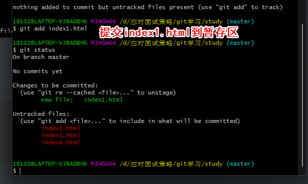

### 已修改

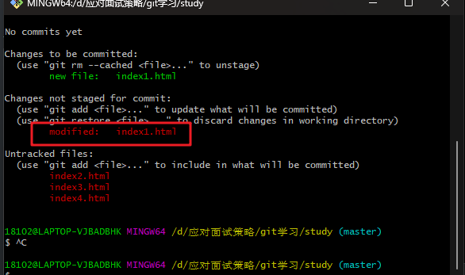

## 查看提交记录

````bash
git  log  //查看提交的记录

git log  --oneline   //查看提交记录，简洁的提交记录
````

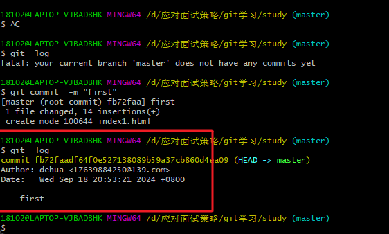

## 回退

```bash
git reset   id     //回退到之前某一个提交的状态
还有三种参数          
命令                     工作区       暂存区
git reset --soft          保留        保留
git reset --hard         不保留      不保留
git reset --mixed         保留       不保留
```

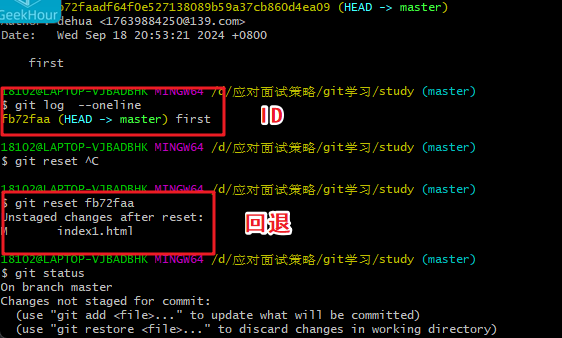

演示一下把  创建四个文件  我们依次提交

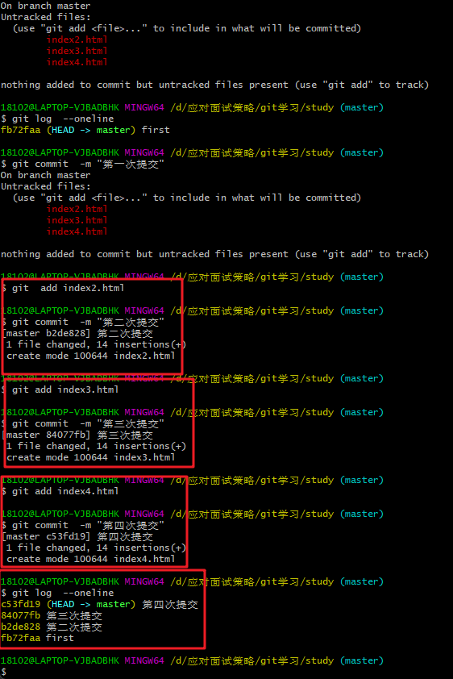

## 分支操作（重点）

```bash
git  branch      //查看当前分支
git  branch     分支名字    //创建分支
git checkout   分支名字     // 切换分支
git switch    分支名字     //切换分支，（推荐写法）
```


### 查看，创建分支

```bash
git  branch      //查看当前分支
git  branch     分支名字    //创建分支
```

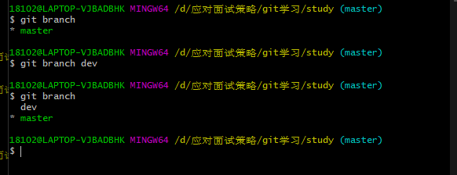

### 切换分支

::: danger   注意的点

我现在在dev上面  创建两个文件  并且提交

然后我切回master分支上面  dev的东西就消失了

因为代码没有合并到master上面，现在只是在dev上面

:::

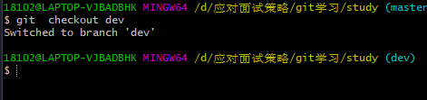

```
git checkout   分支名字     // 切换分支
git switch    分支名字     //切换分支，（推荐写法）
```

### 注意

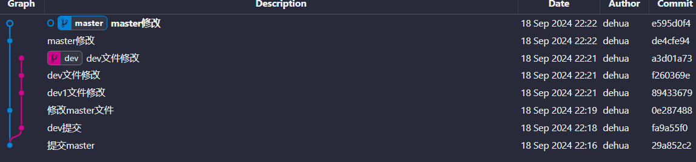

两条线都在频繁的修改

### 合并分支

```bash
git merge  将要合并的分支    //合并分支
```

注意  要进入想合并的分支 ，然后 把想合成的分支写上

1. git  switch   master      （先切换主分支）
2. git  merge  分支名字     （切换分支名字）
3. git  branch  -d  分支名字   （删除合并过的分支）

## 分支合并冲突解决

比如我现在有一个文件，main.ts文件   master  修改文件    feat-wpf分支也修改文件

通过vscode解决 ，非常舒服的

