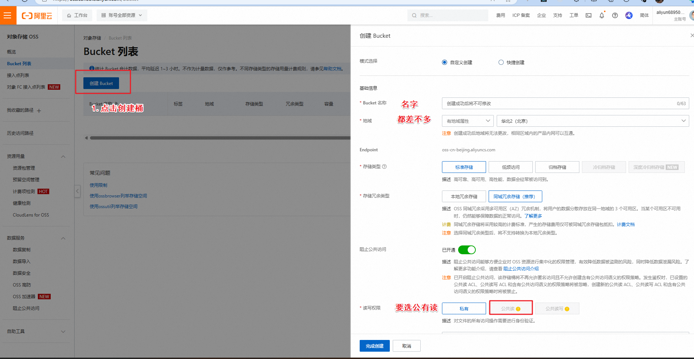
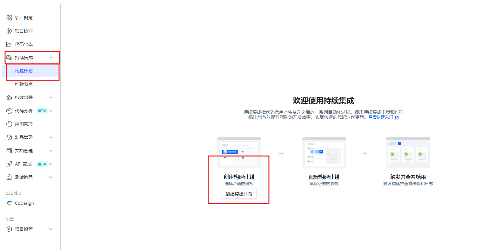
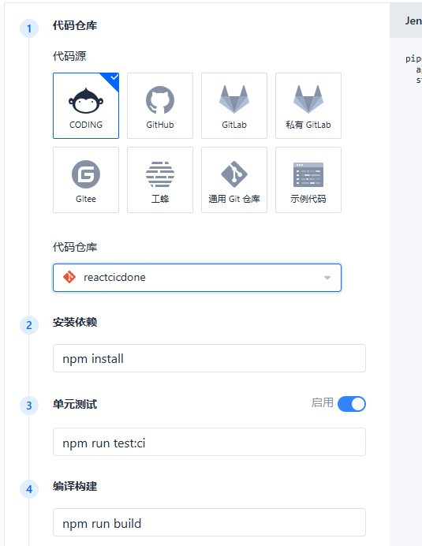
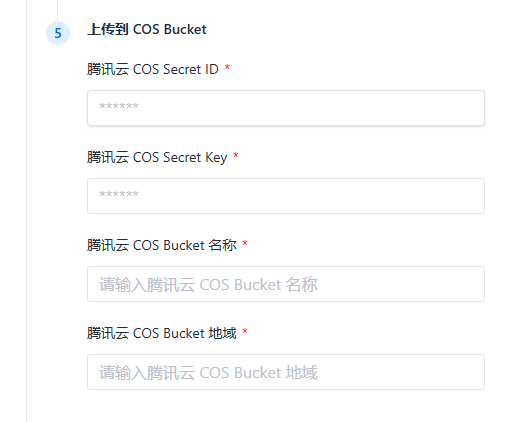
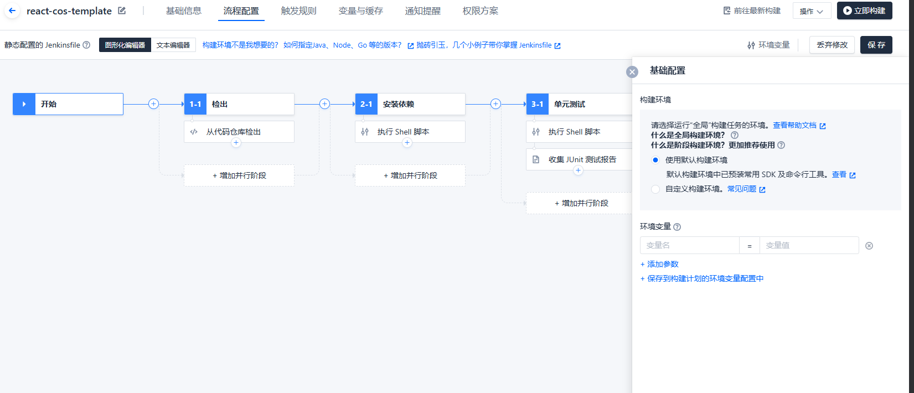
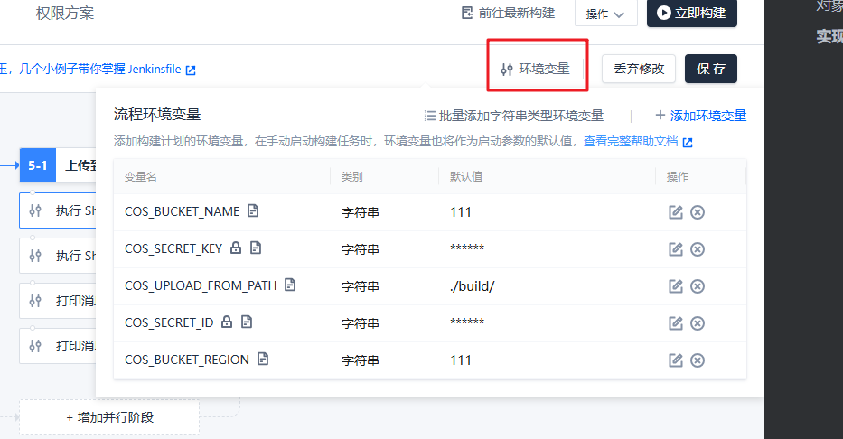
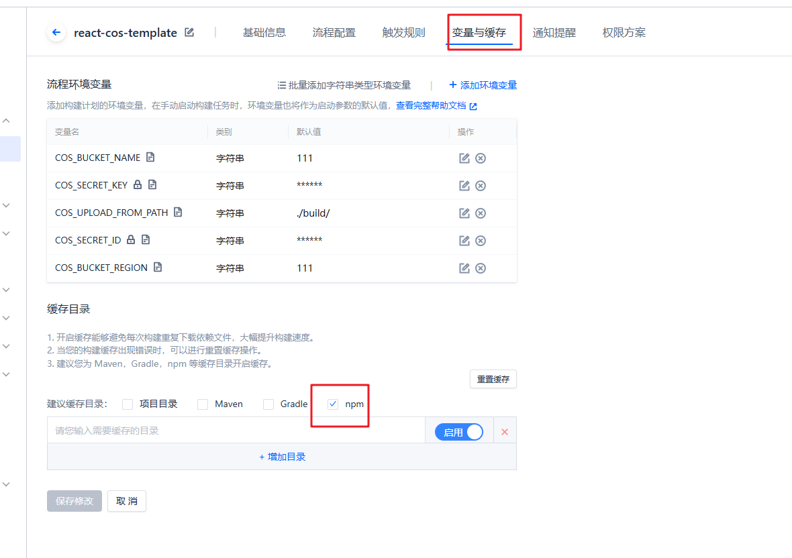

# 介绍

::: danger 部署部署的到底是什么东西

前端 ：  部署的就是静态资源

后端 ：  可执行的文件/代码（所谓的服务）  

​				后端代码，不一定需要打包，得看node可不可以运行了，ts是要编译的

下面部署前端后端使用阿里云 （阿里云/腾讯云）   其实没区别的  都是一样的

:::

## 举例

创建两个项目，一个react 一个nest 项目

react 代理  就可以了

```tsx
import axios from 'axios'
import { useEffect, useState } from 'react'

function App() {
  const [user, setUser] = useState()

  useEffect(() => {
    axios.get('/api').then((res) => {
      setUser(res.data)
    })
  }, [])

  return (
    <div>
      <div>我是主页</div>
      <div>数据:{user}</div>
    </div>
  )
}

export default App
```

```tsx
import { defineConfig } from 'vite'
import react from '@vitejs/plugin-react'

// https://vitejs.dev/config/
export default defineConfig({
  plugins: [react()],
  server: {
    proxy: {
      '/api': {
        target: 'http://localhost:3000/',
        changeOrigin: true,
        secure: false,
        rewrite: (path) => path.replace(/^\/api/, ''),
      },
    },
  },
})
```

nest返回数据

```typescript
import { Controller, Get } from '@nestjs/common';
import { AppService } from './app.service';

@Controller()
export class AppController {
  constructor(private readonly appService: AppService) {}

  @Get()
  getHello(): string {
    return this.appService.getHello();
  }
}
```

```typescript
import { Injectable } from '@nestjs/common';

@Injectable()
export class AppService {
  getHello(): string {
    return '我是后端返回的数据!';
  }
}
```

## 对象存储使用



打包文件直接打开，是打不开的，因为是绝对路径，我们要在打包的时候配置命令

打包的时候加上自己的存储对象的地址

对打包路径的修改，

```json
"build": "cross-env PUBLIC_URL=https://xxxxxxxxx/build react-scripts build",
```

修改完毕之后，就可以打包，上传到对象存储上面了，

这样就实现了纯前端的项目部署

**实现了手动的静态资源部署**

```
1.npm run  build
2.生成build文件夹
3.把文件上传到腾讯云对象存储目录
4.就可以访问了
```


## 实现自动化静态资源部署

```
自动可以触发 上面的1，2，3步骤
触发方式  
 1.代码提交到仓库触发
 2.按钮点击触发
```

1.持续集成的构建计划，创建构建计划



选择React+cos 


选择代码仓库，安装依赖，打包命令的配置



对象存储的配置

> ​	一个id,一个密钥，对象存储的名字，和地域



填完之后就可以了



查看环境变量



修改node的版本

```json
stage('Node.js') {
  steps {
    sh 'rm -rf /usr/lib/node_modules/npm/'
    dir ('/root/.cache/downloads') {
      sh 'wget -nc "https://coding-public-generic.pkg.coding.net/public/downloads/node-linux-x64.tar.xz?version=v16.13.0" -O node-v16.13.0-linux-x64.tar.xz | true'
      sh 'tar -xf node-v16.13.0-linux-x64.tar.xz -C /usr --strip-components 1'
      // sh 'wget -nc "https://coding-public-generic.pkg.coding.net/public/downloads/node-linux-x64.tar.xz?version=v14.18.2" -O node-v14.18.2-linux-x64.tar.xz | true'
      // sh 'tar -xf node-v14.18.2-linux-x64.tar.xz -C /usr --strip-components 1'
      // 更多版本：v12.22.7、v17.2.0
    }
    sh 'node -v'
  }
}
```

变量于缓存



## 遇到接口路径问题，前端怎么办

真实的项目部署中，前端的html一定要放在后端提供的静态资源目录中，要保证和服务端域名符合同源策略