---

---

# Git

::: danger 什么是 Git 呢？

Git是一个开源的分布式版本控制系统

方便日常开发项目使用，前端非常有必要学习的一项，可以说是必学的一项！！！

:::

## 拓展Git对比SVN

1. svg 集中式版本控制系统

   版本库是放在中央服务器的，工作时候，用的都是自己的电脑，所以先从中央服务器，获取到最新的代码，如果工作，完成工作之后，需要把代码推送到中央服务器上面，

   集中式版本控制系统，必须联网，才可以进行工作

2. 分布式版本控制系统

   没有中央服务器，每个人电脑，都是完整的版本库，工作的时候不需要联网，因为版本都在自己电脑上面，可以离线工作

## Git安装

[Git (git-scm.com)](https://git-scm.com/)   官方地址

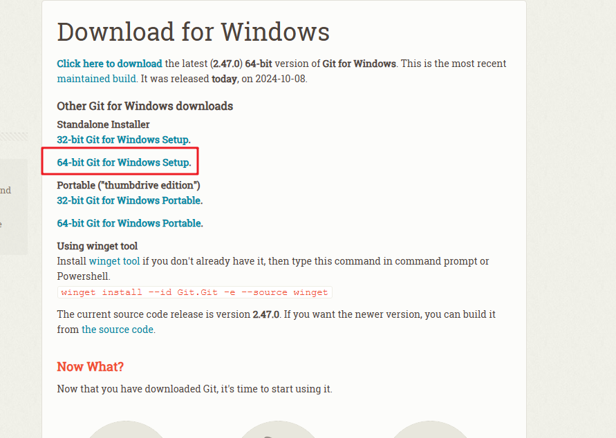

我是window电脑，安装这个就可以了

看看安装步骤

### 第一步，协议（这个无所谓，没人看）直接next吧

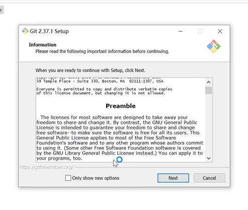

### 第二步 默认够用(直接傻瓜安装)

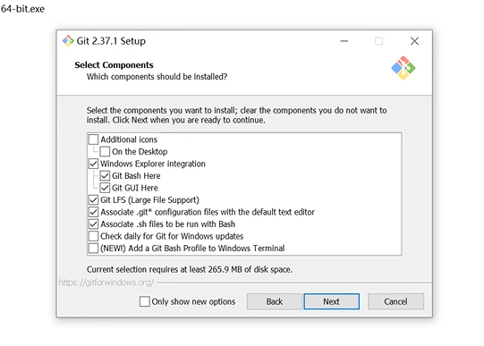

### 后面就步演示了直接傻瓜安装就可以了

### 安装完之后，会发现鼠标右键，会出现这种

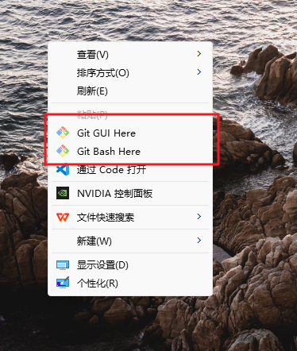

打开这个 Git Bash  Here（单击打开）

```bash
 //查看git的版本
 git --version    
```

 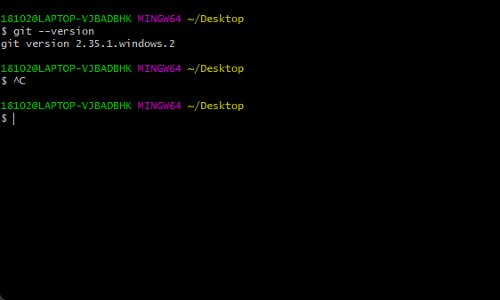

欧克了，这样基本就完事了

## 设置用户签名

::: danger  干什么用的呢？

签名就是用来，标识用户的，用来区分不同的开发人员

这个无所谓，随便写就好了，就是简简单单标识，和提交代码啥的没关系的

:::

```bash
git config --global user.email "xxxxxxxxx.com"

git config --global user.name  "xxxxxxx"
```

可以看一下是否修改成功

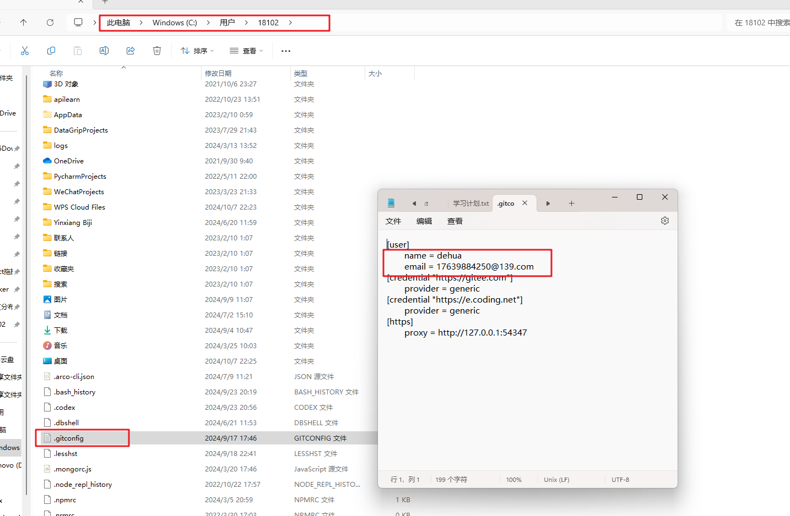

## Linux命令

```bash
cd  xxx/   //进入目录

cd  ..    //返回上一级

ls      //查看当前目录下的文件  (普通的)
ls  -a    查看当前目录下的文件  (全部的)

vim  xxxx    //创建文件
vim  1.txt   演示

进入之后，键盘输入  i  就可以书写了
写完
退出  键盘  右上角ESC退出   输入 :wq  就可以退出了

cat  查看文件内容
```

## 初始化仓库

```bash
git init    //初始化仓库
```


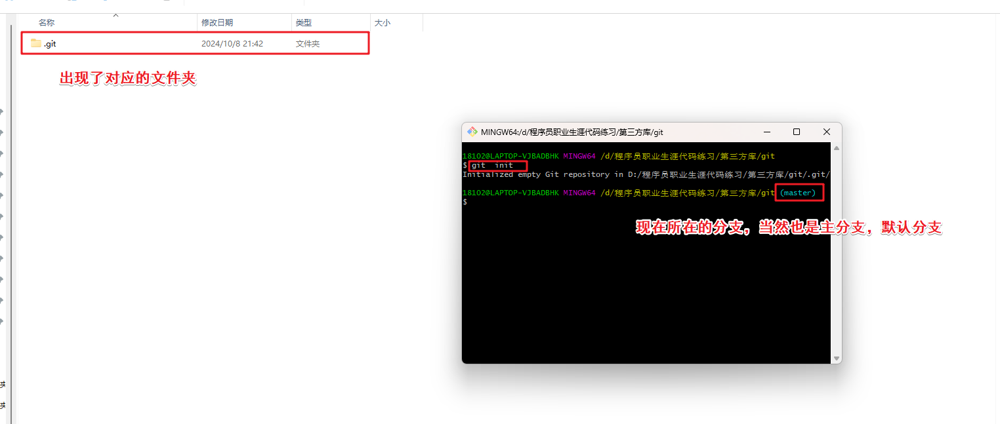

## 重要概念（工作区，暂存区，本地库，版本库，托管平台）

::: danger  介绍一下这几个概念

- 工作区     可以理解成你现在所处于的文件夹，就是平常工作写代码的

- 暂存区      交给git管理，暂时保存

- 历史区    把暂存区的文件commit到历史区，会生成一个提交记录

- 版本库      提交到分支上面，这样其他人也可以拉代码访问到了

- 托管平台  gitlab（内外，外网）   github   gitee

版本库

托管平台

:::

## 常用命令

- 绿色在暂存区
- 红色没有跟踪

### 查看文件状态

```bash
git status
```

这是还没有提交任何文件的时候

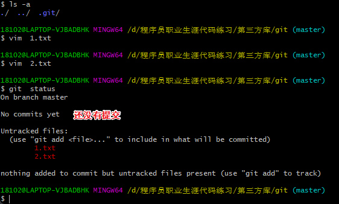

有提交的文件

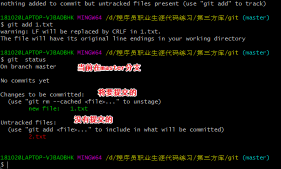


### 提交暂存区

```bash
git  add   xxx   //把xxx文件放入暂存区

git  add  .    //把当前所有文件都放到暂存区
```

### 取消文件暂存区

```bash
git rm --cached  xxx
```

### 提交到本地库

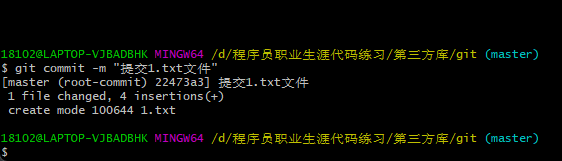

```bash
git  commit -m "文字说明"    //提交版本

git  log   //查看版本
```

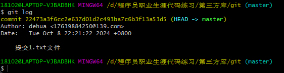

## 版本穿梭

明天学习

```js
 后面记得加尖角好（一个尖角号，就相对于回退一次，如果只有一次，退无可退了，肯定就失败了）
//回退一个版本
git reset  --hard HEAD^
    
// 回退两个版本（上上次版本）
git reset --hard  HEAD^^
```

git  log  查看一下日志

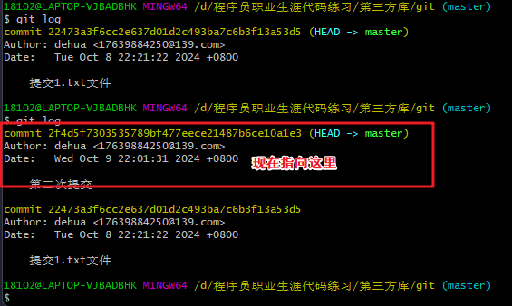

然后我们回退一次（回退成功，我们的代码也会回退到过去）

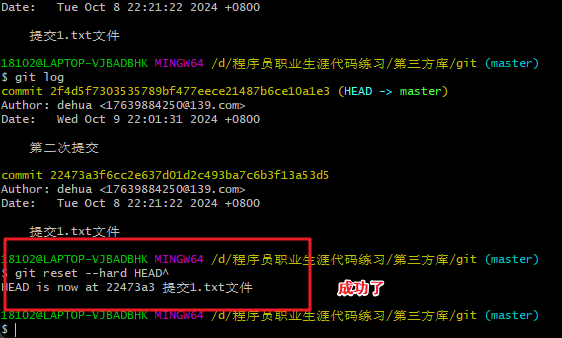

现在就剩一次了，退无可推了，肯定就失败了

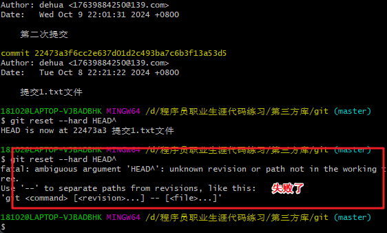

不要以为只能回退，我当然还可以回到我刚才的样子（非常的完美）

- git   reflog
- git reset  --hard   版本号

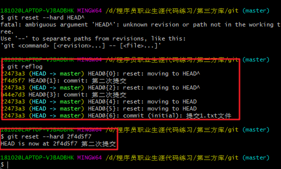

第10课没听明白

## 分支（git非常重要的概念）

::: danger  分支干什么用的呢？

- 上面的HEAD会指向当前正在使用的工作区

- 每一个分支  都有一个单独的工作区

:::

```bash
git branch   //查看分支

git branch  xxxx   //创建xxx分支

#注意分支前会有一个*号  代表您当前在哪个分支

git checkout  xxx  //切换到xxx分支


git  merge xxx  //合并分支  

#合并分支 去到想合并代码的分支 比如我想合到主分支上面  我就要先去主分支  然后把另一个分支拉过来  进行merge

git branch -d xxx  //删除分支

```

## 分支冲突解决

::: danger  为什么会出现冲突呢？

假如公共文件，你修改了，我也修改了，那合并的时候，git就蒙了（他不知道怎么合并你的代码，不知道你哪个要哪个不要，哪些代码是新的，哪些代码是旧的），他就会把这个难题丢给你，你来手都解决冲突

:::

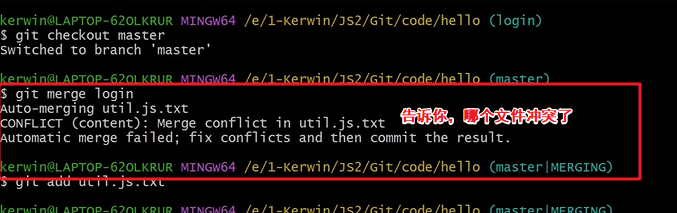

拖到vscode看一下

- 自己手动解决就完事了（没啥难度，vscode很便捷）

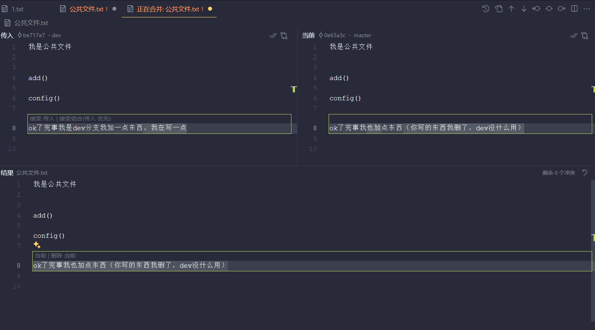

## 托管平台

::: danger  做什么的？

一个团队开发，非常需要

建立远程地址

:::

```bash
git remote  add  origin  https://github.com/xxxxxxxxxxxxxx
#     命令         名字          地址

git  remote  -v
#可以看

git remote remove origin 
#重置远程地址 （如果前面打错了，可以使用这个命令，清空对应的远程地址）

git push    origin    master
#推送代码
#  命令   地址（代号）   远程分支

git pull origin xxx
#拉取远程仓库最新代码

git clone xxxxx
#拉取远程仓库
 
```

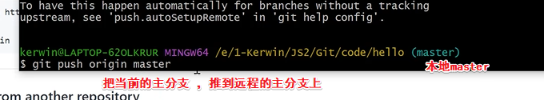

## 平常基本流程

```bash
git add .

git commit -m "xxxxxxxxx"

git  push origin xxxx

git pull origin xxxx

```

## 团队协作基本流程

::: danger  记住一个原则

先拉后推

```bash
git pull  origin xxx

git push  origin xxx
```

我举个例子

比如你下班的时候推代码了，然后溜了，第二天上班，过来先拉一下代码，然后在写新的需求

- 有冲突很正常，有合作就有冲突
- 冲突解决也很简单，根本不慌的

:::

## 团队协助分支管理

::: danger  分支这个太重要了

- 公司项目，不可能让你在主分支上动来动去的，主分支一般是线上环境
- 就比如我现在的公司，一个项目有个200多个分支，主分支代码你推不上去，没有权限的
- 只有通过别的分支提交代码，然后开发完之后，测试完之后，提需求评审，通过之后，会把你的分支，合并到主分支上面
- 一般都是这个流程

:::

来看看怎么完成，分支代码提交到远程仓库

- 场景描述一下：远程仓库没有我这个分支，我这个分支是我本地新创建的，比如

```bash
git branch  xxxx   //创建xxx分支

git checkout  xxx  //切换到xxx分支

#然后我就埋头苦干写代码
#写完之后

git add .
 
git commit -m "描述"

git push orgin xxxx //推到远程仓库

```

- 场景描述一下，别人想拉取远程仓库的其他分支

注意：git clone   拉取的只是主分支的内容

```bash
git pull orgin xxxx   //拉取远程仓库的分支

git checkout  xxxx   //切换分支（刚刚从远程仓库拉取的其他分支）

#然后就可以埋头苦干  写代码了

git add .
 
git commit -m "描述"

git push orgin xxxx //推到远程仓库
```

怎么删除远程仓库对应的分支呢

```bash
git push origin  :xxxxx   //这样就删除远程仓库对应的分支了
```


