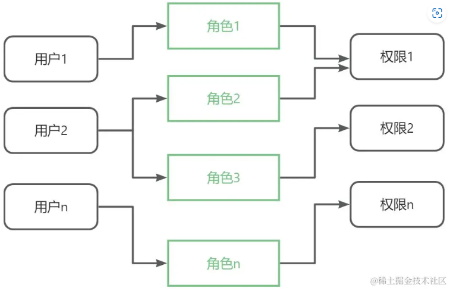

# 介绍

::: danger  权限

其实权限处理这方面最主要有两大点

1. 就是我们的页面级权限，没有权限，不允许进入，没有token只能看login页面，等等
2. 就是我们的按钮级别权限，页面可以进入，但是看到的按钮，数据，可能有细微的差别

这两大点呢，可以分做两大类处理，

1. 前端路由写死，并且给路由身上携带了一些权限的字段，根据后端返回的权限字段，返回相应的页面
2. 前端只写了所有权限都可以访问的页面，其他页面数据，需要从后端获取登录用户相应的页面

::: 

## 项目介绍

```json
这个项目是公司最重要的项目
九大模块
1. 用户管理模块
2. 代理管理模块
3. 游戏设置模块
4. 用户提现模块
5. App更新模块
6. 问卷列表低代码模块
7. 公告模块
8. 可视化模块
9. 权限管理

##三大权限
超级管理员    管理员	 代理	

##权限分成三部分
超级管理员 
-  可以进入全部页面
管理员		
-  除了 权限管理 其他都可以    
代理			
-  用户管理模块，只能禁用
-  可视化模块

根据上面的设计 可以和后端商量数据结构
###分成3个权限
最高级管理员（老板）  super
管理员  			 admin
代理				  group

### 四个按钮
  查看       修改        删除      禁用   
  look	 change	 	  delete	  stop   
```

## 前端梳理的数据结构

```typescript
interface Router {
  path: string   //路径               
  element: React.ReactNode   //tsx组件
  children?: Router[]   //子路由
  meta?: {   //路由其他信息
    auth?: string[]     //super  admin  group  这三个 权限  如果后期验证包含那就可以查看页面，不然就返回login
    name: string    //当前路由名字（可以和菜单做联动）
    needLogin?: boolean   //登录态  有token可以访问（true）   没token就返回登录页面（false）
    btns?: {  
      super?: string[]  //look（查看）change（修改）delete（删除） stop（禁用） 这四种  有就有相应权限
      admin?: string[]  //look（查看）change（修改）delete（删除） stop（禁用） 这四种  有就有相应权限
      group?: string[]  //look（查看）change（修改）delete（删除） stop（禁用） 这四种  有就有相应权限
    }
  }
}
```

欧克接下来就差不多了，可以开始了，看一下初始路由

```tsx
const routes: Router[] = [
  {
    path: '/login',
    element: <Login />,
  },
  {
    path: '/',
    element: <Main />,
    children: [
      {
        path: '/Chart',
        element: <Chart />,
      },
      {
        path: '/userInfo',
        element: <UserInfo />,
        children: [
          {
            path: '/userInfo/AAA',
            element: <Aaa />,
          },
          {
            path: '/userInfo/Bbb',
            element: <Bbb />,
          },
          {
            path: '/userInfo/Ccc',
            element: <Ccc />,
          },
        ],
      },
      {
        path: '/groupInfo',
        element: <GroupInfo />,
      },
      {
        path: '/gameInfo',
        element: <GameInfo />,
      },
      {
        path: '/UserPrice',
        element: <UserPrice />,
      },
      {
        path: '/AppUpdata',
        element: <AppUpdata />,
      },
      {
        path: '/Questionnaire',
        element: <Questionnaire />,
      },
      {
        path: '/Affiche',
        element: <Affiche />,
      },
      {
        path: '/Authpage',
        element: <Authpage />,
      },
    ],
  },
  {
    path: '/nopermission', // 没有权限提示页面
    element: <Nopermission />,
    meta: {
      name: '暂无权限',
      needLogin: false,
    },
  },
  {
    path: '*', // 404
    element: <Error404 />,
  },
]
```


## 一	路由权限管理

::: danger  权限一般分为两大部分

1.路由页面级权限

2.按钮级别权限

不同的账号显示的菜单栏不同，页面上可以操作的按钮也不一样，这些操作都是通过权限模型实现的，那么接下来我们就来学习下常见的权限模型

:::

### RBAC（角色的访问控制模型）

RBAC 模型的基本思想是将用户和权限分离，通过角色作为中间层来连接用户和权限

一个角色可以关联多个权限，一个用户可以拥有多个角色。这样可以实现灵活的权限配置和管理，避免直接给用户分配权限带来的复杂性和冗余性。



比如我现在请求接口

肯定你和后端商量，比如现在

**分成3个权限**

最高级管理员（老板）  super

管理员  						admin

代理							group

### 四个按钮

  查看       修改        删除      禁用   

  look	 change	 delete		stop    all

### **最后组合起来**

```json
"super.look.change.delete.stop.all"
```

然后可以分成 每个权限的设置

```json
返回的是
{
code:200,
msg:"获取成功"
data:{
    xxxx:
    auth:"super.look.change.delete.stop.all"
},
}
```


关于 按钮级别的权限，可以对按钮进行封装

```tsx
// AuthBtn
import React, { useState, useEffect, useRef } from 'react';
import { Button } from 'antd';

const AuthBtn: React.FC<{}> = (props) => {
  let { authId, children } = props;
  // btnIds 应该有后台接口返回，告诉前端用户有哪些按钮权限
  let btnIds = ['read', 'edit'];
  let hasAuth = btnIds.includes(authId);
  // 这里可以根据实际需求封装
  return <Button disabled={!hasAuth}>{children}</Button>;
};
export default AuthBtn;

// index.ts
<AuthBtn authId="read">read 只读权限</AuthBtn>
<AuthBtn authId="write">write 写入权限</AuthBtn>

```

如果我一开始分成三部分


### 前端是路由写死

::: danger  实现思路

这种方案的核心就是首先在 `routes` 里面事先定义好路由的权限，然后在高阶组件里面进行权限逻辑判断。看用户所拥有的角色和我们配置在路由里面的 `roles` 是否相匹配。匹配则允许进入，不匹配则重定向到无权限提示页面。

:::

首先先看路由方面是怎么设计的

其实看了这个就基本上知道要怎么设计了

```tsx
interface Router {
  path: string   //路径               
  element: React.ReactNode   //tsx组件
  children?: Router[]   //子路由
  meta?: {   //路由其他信息
    auth?: string[]     //super  admin  group  这三个 权限  如果后期验证包含那就可以查看页面，不然就返回login
    name: string    //当前路由名字
    needLogin?: boolean   //登录态  有token可以  没token  就返回
    btns?: {  
      super?: string[]  //  look（查看全部）	 change（修改）	 delete（删除）	 stop（禁用态）  这四种  按钮  有就有相应权限
      admin?: string[]  //  look	 change	 delete	 stop  这四种  按钮  有就有相应权限
      group?: string[]  //  look	 change	 delete	 stop  这四种  按钮  有就有相应权限
    }
  }
}
```

```tsx
import { Navigate } from 'react-router-dom'
import Auth from './Auth.tsx'
import Login from '../page/Login.tsx'
import Main from '../page/Main.tsx'
import UserInfo from '../page/userInfo.tsx'
import GroupInfo from '../page/groupInfo.tsx'
import GameInfo from '../page/gameInfo.tsx'
import UserPrice from '../page/userPrice.tsx'
import AppUpdata from '../page/appUpdata.tsx'
import Questionnaire from '../page/questionnaire.tsx'
import Affiche from '../page/affiche.tsx'
import Chart from '../page/chart.tsx'
import Authpage from '../page/auth.tsx'
import Aaa from '../page/userComponents/Aaa.tsx'
import Bbb from '../page/userComponents/Bbb.tsx'
import Ccc from '../page/userComponents/Ccc.tsx'
import Error404 from '../page/Error404.tsx'

interface Router {
  path: string
  element: React.ReactNode
  children?: Router[]
  meta?: {
    auth?: string[]
    name: string
    needLogin?: boolean
    btns?: {
      super?: string[]
      admin?: string[]
      group?: string[]
    }
  }
}

const routes: Router[] = [
  {
    path: '/login',
    element: <Login />,
    meta: {
      name: '登录',
      needLogin: false,
    },
  },
  {
    path: '/',
    element: <Main />,
    children: [
      {
        path: '/Chart',
        element: <Chart />,
        meta: {
          auth: ['admin', 'super', 'group'],
          name: '图表',
          needLogin: true,
        },
      },
      {
        path: '/userInfo',
        element: <UserInfo />,
        meta: {
          auth: ['admin', 'super', 'group'],
          name: '用户信息',
          needLogin: false,
        },
        children: [
          {
            path: '/userInfo/AAA',
            element: <Aaa />,
            meta: {
              auth: ['admin', 'super'],
              name: '管理员',
            },
          },
          {
            path: '/userInfo/Bbb',
            element: <Bbb />,
            meta: {
              auth: ['admin', 'super'],
              name: '管理员',
            },
          },
          {
            path: '/userInfo/Ccc',
            element: <Ccc />,
            meta: {
              auth: ['group'],
              name: '代理',
            },
          },
        ],
      },
      {
        path: '/groupInfo',
        element: <GroupInfo />,
        meta: {
          auth: ['admin', 'super'],
          name: '代理信息',
        },
      },
      {
        path: '/gameInfo',
        element: <GameInfo />,
        meta: {
          auth: ['admin', 'super'],
          name: '游戏设置',
        },
      },
      {
        path: '/UserPrice',
        element: <UserPrice />,
        meta: {
          auth: ['admin', 'super'],
          name: '用户提现',
        },
      },
      {
        path: '/AppUpdata',
        element: <AppUpdata />,
        meta: {
          auth: ['admin', 'super'],
          name: '版本更新',
        },
      },
      {
        path: '/Questionnaire',
        element: <Questionnaire />,
        meta: {
          auth: ['admin', 'super'],
          name: '问卷调查',
        },
      },
      {
        path: '/Affiche',
        element: <Affiche />,
        meta: {
          auth: ['admin', 'super'],
          name: '公告',
          needLogin: true,
        },
      },
      {
        path: '/Authpage',
        element: <Authpage />,
        meta: {
          auth: ['super'],
          name: '权限管理',
          needLogin: true,
          btns: {
            admin: ['add', 'delete', 'edit', 'select'], // admin 有增删改查按钮
            manage: ['select'], // 普通管理员只有查看按钮
          },
        },
      },
    ],
  },
  {
    path: '*',
    element: <Error404 />,
  },
]
// 使用 routes 数组来创建浏览器路由器

// HOC
const authLoad = (element: any, meta = {}) => {
  return <Auth meta={meta}>{element}</Auth>
}
// 路由配置列表数据转换
export const transformRoutes = (routes: any) => {
  const list: any = []
  routes.forEach((route: any) => {
    const obj = { ...route }
    if (obj.redirect) {
      obj.element = <Navigate to={obj.redirect} replace={true} />
    }
    if (obj.element) {
      obj.element = authLoad(obj.element, obj.meta)
    }
    delete obj.redirect
    delete obj.meta

    if (obj.children) {
      obj.children = transformRoutes(obj.children)
    }
    list.push(obj)
  })
  return list
}

export default routes

```

#### 第一个方法

这个主要是干什么的呢

1. 先进行登录的判定  没有token就去登录页
2. 进行有没有权限的判定   路由的auth如果不包括登录接口的auth  那就去无权限页面
3. 如果前两个条件通过了，那就可以正常展示组件了

```tsx
const authLoad = (element: any, meta = {}) => {
  return <Auth meta={meta}>{element}</Auth>
}
```

```tsx
// router/Auth.js

import { Navigate } from 'react-router-dom'

export default function Auth(props: any) {
  // 获取用户信息
  const userInfo = { auth: 'group', name: 'jack', needLogin: true }  //登录接口的数据
  const token = localStorage.getItem('token')  //也是登录的数据
  const { meta } = props   //获取路由的meta信息

  // 设置标题
  if (meta.title) {
    document.title = meta.title
  }

  // 权限校验
  if (meta.needLogin && !token) {
    return <Navigate to="/login" replace></Navigate>
  }

  // 路由需要角色、并且当前有用户信息 并且角色不匹配则去没有权限页面
  if (meta && meta.auth && userInfo && !meta.auth.includes(userInfo.auth)) {
    return <Navigate to="/nopermission" replace></Navigate>
  }

  return <>{props.children}</>
}
```

#### 第二个方法

```tsx
// 路由配置列表数据转换
export const transformRoutes = (routes: any) => {
  const list: any = []
  routes.forEach((route: any) => {
    const obj = { ...route }
    if (obj.element) {
      obj.element = authLoad(obj.element, obj.meta)
    }

    delete obj.meta

    if (obj.children) {
      obj.children = transformRoutes(obj.children)
    }
    list.push(obj)
  })
  return list
}
```

这个方法是干嘛的呢

1. 相对于遍历 authLoad 方法，也就是我们刚才的方法
2. 递归处理 然后返回我们的数据

#### App组件挂载路由

```tsx
// app.jsx

import { useRoutes } from 'react-router-dom'
import routes, { transformRoutes } from './Router/index'

function App() {
  const pages = useRoutes(transformRoutes(routes))

  console.log(pages, 'pages')

  return <div className="app-wrapper">{pages}</div>
}

export default App
```

#### 入口文件包裹

```tsx
import { createRoot } from 'react-dom/client'
import App from './App.tsx'

import { BrowserRouter } from 'react-router-dom'

createRoot(document.getElementById('root')!).render(
  <BrowserRouter>
    <App />
  </BrowserRouter>
)
```

### 前端动态添加路由

::: danger  实现思路

上面的方案只适用于角色固定的系统，对于需要后台动态创建角色的系统就不适用了。对于需要动态创建角色的系统这种动态添加路由的方式就很好用。

:::

这一步 先将所有用户都有的路由定义好，然后其他路由根据用户的权限进行返回

```tsx
import Auth from './Auth.tsx'

import { lazy, Suspense } from 'react'
interface Router {
  path: string
  element: any
  children?: Router[]
  meta?: {
    auth?: string[]
    name: string
    needLogin?: boolean
    btns?: {
      super?: string[]
      admin?: string[]
      group?: string[]
    }
  }
}

const routes: Router[] = [
  {
    path: '/login',
    element: '../page/Login.tsx',
    meta: {
      name: '登录',
      needLogin: false,
    },
  },
  {
    path: '/nopermission', // 没有权限提示页面
    element: '../page/nopermission.tsx',
    meta: {
      name: '暂无权限',
      needLogin: false,
    },
  },
  {
    path: '*',
    element: '../page/Error404.tsx',
  },
]
// 使用 routes 数组来创建浏览器路由器

// HOC
const authLoad = (element: any, meta = {}) => {
  console.log(element, meta, '>>>>>>>>>>>>>>>>>>>>>>>>')

  const Component = lazy(() => import(element))
  console.log(Component, 'Component')

  return (
    <Suspense>
      <Auth meta={meta}>
        <Component></Component>
      </Auth>
    </Suspense>
  )
}

// 路由配置列表数据转换
export const transformRoutes = (routes: any) => {
  const list: any = []
  routes.forEach((route: any) => {
    const obj = { ...route }
    if (obj.element) {
      obj.element = authLoad(obj.element, obj.meta)
    }

    delete obj.meta

    if (obj.children) {
      obj.children = transformRoutes(obj.children)
    }
    list.push(obj)
  })

  return list
}

export default routes

```

#### 第一部分

```tsx
interface Router {
  path: string
  element: any
  children?: Router[]
  meta?: {
    auth?: string[]
    name: string
    needLogin?: boolean
    btns?: {
      super?: string[]
      admin?: string[]
      group?: string[]
    }
  }
}

const routes: Router[] = [
  {
    path: '/login',
    element: '../page/Login.tsx',
    meta: {
      name: '登录',
      needLogin: false,
    },
  },
  {
    path: '/nopermission', // 没有权限提示页面
    element: '../page/nopermission.tsx',
    meta: {
      name: '暂无权限',
      needLogin: false,
    },
  },
  {
    path: '*',
    element: '../page/Error404.tsx',
  },
]
```

声明routes,这是当前所有权限都可以访问的页面

#### 第二部分

对传过来的路由进行懒加载注册，并且携带meta属性传给组件内部

```tsx
const authLoad = (element: any, meta = {}) => {
  const Component = lazy(() => import(element))
  return (
    <Suspense>
      <Auth meta={meta}>
        <Component></Component>
      </Auth>
    </Suspense>
  )
}
```

这个组件做了什么，对所页面进行是否有token登录的验证

```tsx
// router/Auth.js

import { Navigate } from 'react-router-dom'

export default function Auth(props: any) {
  const token = localStorage.getItem('token')
  const { meta } = props

  // 权限校验
  if (meta.needLogin && !token) {
    return <Navigate to="/login" replace></Navigate>
  }

  return <>{props.children}</>
}

```

#### 第三部分

做了什么

递归处理后端返回来的路由表

```tsx
// 路由配置列表数据转换
export const transformRoutes = (routes: any) => {
  const list: any = []
  routes.forEach((route: any) => {
    const obj = { ...route }
    if (obj.element) {
      obj.element = authLoad(obj.element, obj.meta)
    }

    delete obj.meta

    if (obj.children) {
      obj.children = transformRoutes(obj.children)
    }
    list.push(obj)
  })

  return list
}

export default routes
```

#### 看一下app怎么处理的

```tsx
// app.jsx

import { useRoutes } from 'react-router-dom'
import routes, { transformRoutes } from './Router/index'

// 获取仓库数据
import { useSelector } from 'react-redux'

function App() {
  // 先合并  然后我在转换
  const routerData = useSelector((state: any) => state.count.routerData)
  const router = routerData.concat(routes)
  const pages = useRoutes(transformRoutes(router))

  return <div className="app-wrapper">{pages}</div>
}

export default App

```

#### 入口文件挂载

```tsx
import { createRoot } from 'react-dom/client'
import App from './App.tsx'

import { BrowserRouter } from 'react-router-dom' //路由挂载

// 仓库
import sotre from './store/index.tsx'
import { Provider } from 'react-redux'

createRoot(document.getElementById('root')!).render(
  <Provider store={sotre}>
    <BrowserRouter>
      <App />
    </BrowserRouter>
  </Provider>
)
```

#### 后端返回的数据

```json
 {
    msg: '登录成功',
    code: '200',
    data: {
      token: 'xx:xxxxxxxxxxxxxxxxxxxxxxxxxxxxxxxxxxxxxxx',
      username: '我是普通管理员',
      router: [
        {
          path: '/',
          element: '../page/Main.tsx',
          children: [
            {
              path: '/Chart',
              element: '../page/chart.tsx',
              meta: {
                name: '图表',
                needLogin: true,
              },
            },
            {
              path: '/userInfo',
              element: '../page/userInfo.tsx',
              meta: {
                name: '用户信息',
                needLogin: false,
              },
              children: [
                {
                  path: '/userInfo/AAA',
                  element: '../page/userComponents/Aaa.tsx',
                  meta: {
                    name: '管理员',
                  },
                },
                {
                  path: '/userInfo/Bbb',
                  element: '../page/userComponents/Bbb.tsx',
                  meta: {
                    name: '管理员',
                  },
                },
                {
                  path: '/userInfo/Ccc',
                  element: "'../page/userComponents/Ccc.tsx'",
                  meta: {
                    name: '代理用户',
                  },
                },
              ],
            },
            {
              path: '/groupInfo',
              element: '../page/groupInfo.tsx',
              meta: {
                name: '代理信息',
              },
            },
            {
              path: '/gameInfo',
              element: '../page/gameInfo.tsx',
              meta: {
                name: '游戏设置',
              },
            },
            {
              path: '/UserPrice',
              element: '../page/userPrice.tsx',
              meta: {
                name: '用户提现',
              },
            },
            {
              path: '/AppUpdata',
              element: '../page/appUpdata.tsx',
              meta: {
                name: '版本更新',
              },
            },
            {
              path: '/Questionnaire',
              element: '../page/questionnaire.tsx',
              meta: {
                name: '问卷调查',
              },
            },
            {
              path: '/Affiche',
              element: '../page/affiche.tsx',
              meta: {
                name: '公告',
                needLogin: true,
              },
            },
          ],
        },
      ],
    },
    }
```

## 二 按钮级别权限管理

::: danger  和上面差不多的

1.前端写死

2.后端传过来

比如说我现在的按钮  增删改查 

查看        修改         删除          禁用

 look	 change	 delete		stop

:::

### 先看前端写死的情况

```

```


## 前端路由写死的情况 


### 设计路由

要给路由添加对应的权限控制字段和按钮

```tsx
const routes: Router[] = [
  {
    path: '/login',
    element: <Login />,
    meta: {
      name: '登录',
      needLogin: false,
    },
  },
  {
    path: '/',
    element: <Main />,
    children: [
      {
        path: '/Chart',
        element: <Chart />,
        meta: {
          auth: ['admin', 'super', 'group'],
          name: '图表',
          needLogin: true,
          btns: {
            super: ['look', 'change', 'delete', 'stop'],
            admin: ['look', 'change', 'delete', 'stop'],
            group: ['look', 'change', 'delete', 'stop'],
          },
        },
      },
      {
        path: '/userInfo',
        element: <UserInfo />,
        meta: {
          auth: ['admin', 'super', 'group'],
          name: '用户信息',
          needLogin: false,
        },
        children: [
          {
            path: '/userInfo/AAA',
            element: <Aaa />,
            meta: {
              auth: ['admin', 'super', 'group'],
              name: '管理员AAA',
              needLogin: true,
              btns: {
                super: ['look', 'change', 'delete', 'stop'],
                admin: ['look', 'change', 'delete', 'stop'],
                group: ['look', 'change', 'delete', 'stop'],
              },
            },
          },
          {
            path: '/userInfo/Bbb',
            element: <Bbb />,
            meta: {
              auth: ['admin', 'super', 'group'],
              name: '管理员BBB',
              needLogin: true,
              btns: {
                super: ['look', 'change', 'delete', 'stop'],
                admin: ['look', 'change', 'delete', 'stop'],
                group: ['look', 'change', 'delete', 'stop'],
              },
            },
          },
          {
            path: '/userInfo/Ccc',
            element: <Ccc />,
            meta: {
              auth: ['group'],
              name: '管理员CCC',
              needLogin: true,
              btns: {
                group: ['look', 'stop'],
              },
            },
          },
        ],
      },
      {
        path: '/groupInfo',
        element: <GroupInfo />,
        meta: {
          auth: ['admin', 'super'],
          name: '代理信息',
          needLogin: true,
          btns: {
            super: ['look', 'change', 'delete', 'stop'],
            admin: ['look', 'stop'],
          },
        },
      },
      {
        path: '/gameInfo',
        element: <GameInfo />,
        meta: {
          auth: ['admin', 'super'],
          name: '游戏设置',
          needLogin: true,
          btns: {
            super: ['look', 'change', 'delete', 'stop'],
            admin: ['look', 'change', 'delete', 'stop'],
          },
        },
      },
      {
        path: '/UserPrice',
        element: <UserPrice />,
        meta: {
          auth: ['admin', 'super'],
          name: '用户提现',
          needLogin: true,
          btns: {
            super: ['look', 'change', 'delete', 'stop'],
            admin: ['look', 'change', 'delete', 'stop'],
          },
        },
      },
      {
        path: '/AppUpdata',
        element: <AppUpdata />,
        meta: {
          auth: ['admin', 'super'],
          name: '版本更新',
          needLogin: true,
          btns: {
            super: ['look', 'change', 'delete', 'stop'],
            admin: ['look', 'change', 'delete', 'stop'],
          },
        },
      },
      {
        path: '/Questionnaire',
        element: <Questionnaire />,
        meta: {
          auth: ['admin', 'super'],
          name: '问卷调查',
          needLogin: true,
          btns: {
            super: ['look', 'change', 'delete', 'stop'],
            admin: ['look', 'change', 'delete', 'stop'],
          },
        },
      },
      {
        path: '/Affiche',
        element: <Affiche />,
        meta: {
          auth: ['admin', 'super'],
          name: '公告',
          needLogin: true,
          btns: {
            super: ['look', 'change', 'delete', 'stop'],
            admin: ['look', 'change', 'delete', 'stop'],
          },
        },
      },
      {
        path: '/Authpage',
        element: <Authpage />,
        meta: {
          auth: ['super'],
          name: '权限管理',
          needLogin: true,
          btns: {
            super: ['look', 'change', 'delete', 'stop'],
          },
        },
      },
    ],
  },
  {
    path: '/nopermission', // 没有权限提示页面
    element: <Nopermission />,
    meta: {
      name: '暂无权限',
      needLogin: false,
    },
  },
  {
    path: '*',
    element: <Error404 />,
  },
]
```

### 后端返回的数据

```tsx
 // 假如这是后端接口返回的数据  调用后会设置用户信息为
  const userinfo = {
    msg: '登录成功',
    code: '200',
    data: {
      token: 'xx:xxxxxxxxxxxxxxxxxxxxxxxxxxxxxxxxxxxxxxx',
      username: '我是BOOS',
      auth: 'super',
    },
  }
```

### 路由核心index.tsx文件

```tsx
import Auth from './Auth.tsx'
import Login from '../page/Login.tsx'
import Main from '../page/Main.tsx'
import UserInfo from '../page/userInfo.tsx'
import GroupInfo from '../page/groupInfo.tsx'
import GameInfo from '../page/gameInfo.tsx'
import UserPrice from '../page/userPrice.tsx'
import AppUpdata from '../page/appUpdata.tsx'
import Questionnaire from '../page/questionnaire.tsx'
import Affiche from '../page/affiche.tsx'
import Chart from '../page/chart.tsx'
import Authpage from '../page/auth.tsx'
import Aaa from '../page/userComponents/Aaa.tsx'
import Bbb from '../page/userComponents/Bbb.tsx'
import Ccc from '../page/userComponents/Ccc.tsx'
import Nopermission from '../page/nopermission.tsx'
import Error404 from '../page/Error404.tsx'

interface Router {
  path: string
  element: React.ReactNode
  children?: Router[]
  meta?: {
    auth?: string[]
    name: string
    needLogin?: boolean
    btns?: {
      super?: string[]
      admin?: string[]
      group?: string[]
    }
  }
}

    const routes: Router[] = [
  {
    path: '/login',
    element: <Login />,
    meta: {
      name: '登录',
      needLogin: false,
    },
  },
  {
    path: '/',
    element: <Main />,
    children: [
      {
        path: '/Chart',
        element: <Chart />,
        meta: {
          auth: ['admin', 'super', 'group'],
          name: '图表',
          needLogin: true,
          btns: {
            super: ['look', 'change', 'delete', 'stop'],
            admin: ['look', 'change', 'delete', 'stop'],
            group: ['look', 'change', 'delete', 'stop'],
          },
        },
      },
      {
        path: '/userInfo',
        element: <UserInfo />,
        meta: {
          auth: ['admin', 'super', 'group'],
          name: '用户信息',
          needLogin: false,
        },
        children: [
          {
            path: '/userInfo/AAA',
            element: <Aaa />,
            meta: {
              auth: ['admin', 'super', 'group'],
              name: '管理员AAA',
              needLogin: true,
              btns: {
                super: ['look', 'change', 'delete', 'stop'],
                admin: ['look', 'change', 'delete', 'stop'],
                group: ['look', 'change', 'delete', 'stop'],
              },
            },
          },
          {
            path: '/userInfo/Bbb',
            element: <Bbb />,
            meta: {
              auth: ['admin', 'super', 'group'],
              name: '管理员BBB',
              needLogin: true,
              btns: {
                super: ['look', 'change', 'delete', 'stop'],
                admin: ['look', 'change', 'delete', 'stop'],
                group: ['look', 'change', 'delete', 'stop'],
              },
            },
          },
          {
            path: '/userInfo/Ccc',
            element: <Ccc />,
            meta: {
              auth: ['group'],
              name: '管理员CCC',
              needLogin: true,
              btns: {
                group: ['look', 'stop'],
              },
            },
          },
        ],
      },
      {
        path: '/groupInfo',
        element: <GroupInfo />,
        meta: {
          auth: ['admin', 'super'],
          name: '代理信息',
          needLogin: true,
          btns: {
            super: ['look', 'change', 'delete', 'stop'],
            admin: ['look', 'stop'],
          },
        },
      },
      {
        path: '/gameInfo',
        element: <GameInfo />,
        meta: {
          auth: ['admin', 'super'],
          name: '游戏设置',
          needLogin: true,
          btns: {
            super: ['look', 'change', 'delete', 'stop'],
            admin: ['look', 'change', 'delete', 'stop'],
          },
        },
      },
      {
        path: '/UserPrice',
        element: <UserPrice />,
        meta: {
          auth: ['admin', 'super'],
          name: '用户提现',
          needLogin: true,
          btns: {
            super: ['look', 'change', 'delete', 'stop'],
            admin: ['look', 'change', 'delete', 'stop'],
          },
        },
      },
      {
        path: '/AppUpdata',
        element: <AppUpdata />,
        meta: {
          auth: ['admin', 'super'],
          name: '版本更新',
          needLogin: true,
          btns: {
            super: ['look', 'change', 'delete', 'stop'],
            admin: ['look', 'change', 'delete', 'stop'],
          },
        },
      },
      {
        path: '/Questionnaire',
        element: <Questionnaire />,
        meta: {
          auth: ['admin', 'super'],
          name: '问卷调查',
          needLogin: true,
          btns: {
            super: ['look', 'change', 'delete', 'stop'],
            admin: ['look', 'change', 'delete', 'stop'],
          },
        },
      },
      {
        path: '/Affiche',
        element: <Affiche />,
        meta: {
          auth: ['admin', 'super'],
          name: '公告',
          needLogin: true,
          btns: {
            super: ['look', 'change', 'delete', 'stop'],
            admin: ['look', 'change', 'delete', 'stop'],
          },
        },
      },
      {
        path: '/Authpage',
        element: <Authpage />,
        meta: {
          auth: ['super'],
          name: '权限管理',
          needLogin: true,
          btns: {
            super: ['look', 'change', 'delete', 'stop'],
          },
        },
      },
    ],
  },
  {
    path: '/nopermission', // 没有权限提示页面
    element: <Nopermission />,
    meta: {
      name: '暂无权限',
      needLogin: false,
    },
  },
  {
    path: '*',
    element: <Error404 />,
  },
]

// HOC
const authLoad = (element: any, meta = {}) => {
  return <Auth meta={meta}>{element}</Auth>
}
// 路由配置列表数据转换
export const transformRoutes = (routes: any) => {
  const list: any = []
  routes.forEach((route: any) => {
    const obj = { ...route }
    if (obj.element) {
      obj.element = authLoad(obj.element, obj.meta)
    }

    delete obj.meta

    if (obj.children) {
      obj.children = transformRoutes(obj.children)
    }
    list.push(obj)
  })
  console.log(list, 'list')
  return list
}

export default routes
```

#### 介绍一下

##### 第一部分

分就不用说了,前端路由后端路由商量设计出来的

##### 第二部分

```tsx
const authLoad = (element: any, meta = {}) => {
  return <Auth meta={meta}>{element}</Auth>
}
```

这个组件做了什么

> 1. 获取用户信息  获取token 和权限
> 2. 路由的权限信息
> 3. 先判断有没有token，并且当前页面是否有needLogin属性 如果是true 就需要token
> 4. 判断有没有权限  没有就跳到无权限页面
> 5. cloneElement 克隆并返回新的 React元素的函数，第一个是克隆的元素，第二个是新Props

```tsx
import { Navigate, useLocation } from 'react-router-dom'

import { cloneElement } from 'react'

export default function Auth(props: any) {
  // 获取用户信息  获取token 和权限
  const userInfo: any = localStorage.getItem('userinfo')
  const token = localStorage.getItem('token')
  // 路由的权限信息
  const { meta } = props

  const location = useLocation()
  console.log('auth', userInfo, props, location)

  // 权限校验 没有token 并且当前页面是true
  if (meta.needLogin && !token) {
    return <Navigate to="/login" replace></Navigate>
  }
  // 路由需要角色、并且当前有用户信息 并且角色不匹配则去没有权限页面
  if (meta && meta.roles && userInfo && !meta.roles.includes(userInfo.auth)) {
    return <Navigate to="/nopermission" replace></Navigate>
  }

  // 为了给jsx传递属性，使用了 cloneElement。简单点的话可以在routes里面定义组件本身而不是jsx组件。
  // 细节  使用 cloneElement克隆并返回新的 React元素的函数
  const _cloneElement = cloneElement(props.children, {
    btns: meta.btns && userInfo ? meta.btns[userInfo.role] : [],
  })

  return <>{_cloneElement}</>
}

```

##### 第三部分

> 递归组件,形成一颗路由树

```tsx
// 路由配置列表数据转换
export const transformRoutes = (routes: any) => {
  const list: any = []
  routes.forEach((route: any) => {
    const obj = { ...route }
    if (obj.element) {
      obj.element = authLoad(obj.element, obj.meta)
    }

    delete obj.meta

    if (obj.children) {
      obj.children = transformRoutes(obj.children)
    }
    list.push(obj)
  })

  return list
}
```

### APP.JSX

```tsx
// App.jsx

import { useRoutes } from 'react-router-dom'
import routes, { transformRoutes } from './Router/index'

function App() {
  const pages = useRoutes(transformRoutes(routes))

  return <div className="app-wrapper">{pages}</div>
}

export default App

```

到这里路由已经实现权限管理了

看看按钮权限怎么实现

任意一个组件，比如Ccc组件，

```

```

