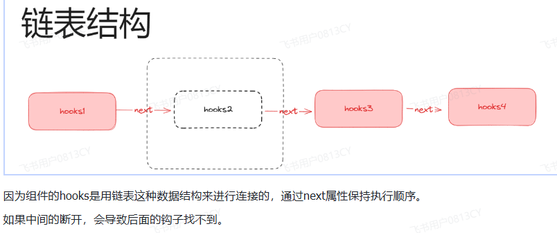
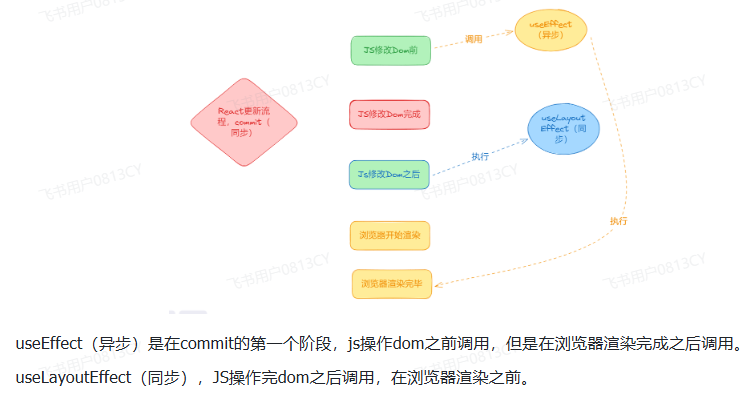
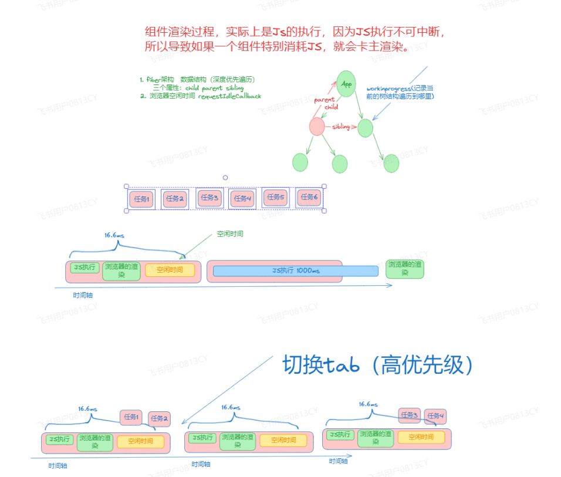

# 组件基础

## 一 React合成事件？React 事件机制？

它不同于原生 DOM 事件。React 之所以引入合成事件，主要是为了解决跨浏览器兼容性问题，同时提供了一种更高效的方式来处理事件

可以理解成 JSX 上写的事件并没有绑定在对应的真实 DOM 上，而是通过事件代理的方式，将所有的事件都统一绑定在了 `document` 上。这样的方式不仅减少了内存消耗，还能在组件挂载销毁时统一订阅和移除事件。

实现合成事件的目的如下：

- 合成事件首先抹平了浏览器之间的兼容问题，另外这是一个跨浏览器原生事件包装器，赋予了跨浏览器开发的能力；
- 对于原生浏览器事件来说，浏览器会给监听器创建一个事件对象。如果你有很多的事件监听，那么就需要分配很多的事件对象，造成高额的内存分配问题。但是对于合成事件来说，有一个事件池专门来管理它们的创建和销毁，当事件需要被使用时，就会从池子中复用对象，事件回调结束后，就会销毁事件对象上的属性，从而便于下次复用事件对象。

### 为什么使用合成事件呢？

React 之所以引入合成事件，主要是为了解决**跨浏览器兼容性问题**，并且还**性能优化**

1. 不同的浏览器对 DOM 事件的实现存在差异，比如事件对象的属性、事件冒泡和捕获的行为等。React 通过合成事件层封装了这些差异，使得开发者可以编写一致的事件处理代码，而无需担心浏览器兼容性问题。
2. React 的合成事件系统通过事件池（Event Pooling）机制来优化性能。在 React 16 之前的版本中，事件对象在事件处理函数执行完毕后会被销毁，以避免内存泄漏。但是，在 React 16 及以后的版本中，引入了事件池的概念，即 React 会重用事件对象，而不是每次都创建新的对象。这样做可以减少内存分配和垃圾回收的开销，提高应用的性能。

### 合成事件是什么？

React 16.x及以前的合成事件：

1. 事件委托到document；
2. 存在React事件和原生事件的映射关系，比如onMouseLeave会映射成原生的mouseout事件；
3. 事件池机制,在React 16及之前的版本中，React使用了一个称为“事件池”的机制来优化内存使用。这意味着React会重用事件对象，而不是每次事件触发时都创建一个新的对象

React 17后的合成事件：

1. 事件委托到root；
2. React capture阶段的合成事件提前到原生事件capture阶段执行；
3. 移除事件池机制,从React 17开始，这个机制被移除了，因为现代JavaScript引擎的垃圾回收机制已经足够高效，不再需要这种额外的优化

### 阻止事件冒泡？

````
 event.stopPropagation(); // 阻止事件冒泡  
````

## 二 对React-Fiber的理解，它解决了什么问题？

### Fiber解决的问题？

React V15 在渲染时，会递归比对 VirtualDOM 树，找出需要变动的节点，然后同步更新它们。这个过程期间， React 会占据浏览器资源，这会导致用户触发的事件得不到响应，并且会导致掉帧，**导致用户感觉到卡顿**。

### Fiber

Fiber架构的引入正是为了解决这一问题，它通过将渲染过程（渲染，布局，绘制，资源加载）分割成多个小的可中断的任务（即“fiber”），实现了更加灵活和高效的渲染调度。Fiber架构的核心在于引入了“工作循环”（work loop）和“调度器”（scheduler）的概念，使得React可以在渲染过程中适时地让出CPU执行权，允许浏览器处理其他高优先级任务，如用户的输入事件、动画等。

### Fiber好处

1. **提升用户体验**：通过将渲染任务分割成多个小的可中断的单元，Fiber允许React在渲染过程中适时地让出CPU执行权，从而减少了长时间占用UI线程的情况，提升了应用的响应性和流畅度。
2. **优化性能**：Fiber架构允许React在渲染过程中进行优先级排序，优先处理用户交互相关的高优先级任务，如点击事件、滚动事件等，从而提升了应用的性能和用户体验。
3. **更好的错误处理和恢复能力**：Fiber架构的引入还使得React在渲染过程中能够更好地处理错误和异常情况，当遇到错误时，Fiber可以停止当前任务并回滚到安全的状态，而不会影响到整个应用的稳定性。
4. **支持并发模式**：Fiber架构为React的并发模式提供了基础，使得React在未来能够更好地支持异步渲染和流式数据等现代Web开发中的常见需求。

## 三 React中什么是受控组件和非控组件？

一句话说明白 **表单元素值由react状态所掌控**就是受控组件

那么相反  **表单元素的值由DOM元素自身管理**就是非受控组件

**受控组件场景**

- 当需要对用户输入进行实时验证和处理时。
- 当需要确保表单元素的值与React应用的状态保持同步时

**非受控组件场景**

- 当不需要对表单元素的值进行实时操作或验证时。
- 当只需要在表单提交时获取表单的最终值进行处理时。

## 四 React中useRef的作用是什么？有哪些应用场景？

主要作用就是为了获取DOM元素

应用场景

- 处理焦点、文本选择或者媒体的控制
- 触发必要的动画

## 五 React的状态提升是什么？使用场景有哪些？

**将多个组件需要共享的状态提升到它们最近的父组件上**，**在父组件上改变这个状态然后通过props分发给子组件**

## 六 React的组件通信方式

父子组件通信  使用 porps

子父通信使用  自定义函数

跨组件传递    使用  context

### 父子组件通信可以使用 props

```tsx
import React, { useState } from 'react';  
import ChildComponent from './ChildComponent';  
  
function ParentComponent() {  
  // 父组件的状态  
  const [data, setData] = useState('Initial data');  
  
  // 父组件的“方法”，用于更新状态  
  const updateData = (newData) => {  
    setData(newData);  
  };  
  
  return (  
    <div>  
      <h1>Parent Component</h1>  
      <p>Data from Parent: {data}</p>  
      {/* 将数据和更新数据的函数作为props传递给子组件 */}  
      <ChildComponent data={data} updateData={updateData} />  
    </div>  
  );  
}  
  
export default ParentComponent;
```

```tsx
import React from 'react';  
  
function ChildComponent({ data, updateData }) {  
  // 子组件可以直接访问来自父组件的props  
  return (  
    <div>  
      <h2>Child Component</h2>  
      <p>Data from Parent (via props): {data}</p>  
      {/* 调用父组件的“方法”来更新数据 */}  
      <button onClick={() => updateData('Updated data from Child')}>  
        Update Data in Parent  
      </button>  
    </div>  
  );  
}  
  
export default ChildComponent;
```

### 父子组件通信可以使用 props

```tsx
import React from 'react';  
  
function ChildComponent({ onSendData }) {  
  const handleSend = () => {  
    // 准备要发送的数据  
    const dataToSend = 'Data from Child';  
    // 调用父组件传递的回调函数，并发送数据  
    onSendData(dataToSend);  
  };  
  
  return (  
    <div>  
      <h2>Child Component</h2>  
      <button onClick={handleSend}>Send Data to Parent</button>  
    </div>  
  );  
}  
  
export default ChildComponent;
```

```tsx
import React, { useState } from 'react';  
import ChildComponent from './ChildComponent';  
  
function ParentComponent() {  
  // 父组件的状态  
  const [receivedData, setReceivedData] = useState('');  
  
  // 父组件的回调函数，用于接收来自子组件的数据  
  const onSendData = (data) => {  
    // 处理接收到的数据，例如更新状态  
    setReceivedData(data);  
  };  
  
  return (  
    <div>  
      <h1>Parent Component</h1>  
      <p>Data Received from Child: {receivedData}</p>  
      {/* 将回调函数作为props传递给子组件 */}  
      <ChildComponent onSendData={onSendData} />  
    </div>  
  );  
}  
  
export default ParentComponent;
```

跨层传递

```tsx
import React, { createContext, useContext, useState } from 'react'

// 不需要写在组件里面，直接写在组件外面
const nameContext = createContext("我是一层一层下来的数据啊")

export default function App () {
  const [name, setName] = useState("张三")
  return (
    <nameContext.Provider value={{
      name,
      setName
    }}>
      <div>
        APP
        <Bpp></Bpp>
      </div>
    </nameContext.Provider>
  )
}
function Bpp () {
  const name = useContext(nameContext)
  const changeName = () => {
    name.setName("李四")
  }
  return (
    <div>
      BPP
      <button onClick={changeName} >修改数据</button>
      <Cpp></Cpp>
    </div>
  )
}
function Cpp () {
  // 消费
  const name = useContext(nameContext)
  return (
    <div>
      CPP
      {name.name}
    </div>
  )
}
```

## 七 什么是副作用？

副作用可以理解成

副作用指的是那些除了返回函数值之外，还对程序状态或世界产生影响的操作。这些操作包括但不限于：

- 修改浏览器的 DOM
- 设置定时器（`setTimeout`, `setInterval`）
- 发起网络请求

## 八 useSelector的作用？原理？

> 1. Redux             状态仓库
> 2. React-redux    用于连接React和仓库之间的中间件

### 作用

它是react-redux库中的一个方法，它的作用是读取redux store中的某一段数据，更新hooks react组件

### 原理

## 九 useMemo，React.memo  ，useCallback  这三个钩子的作用  怎么配合优化？

> **memo 是防止 props 没变时的重新渲染，**
>
> **useMemo 和 useCallback 是防止 props 的不必要变化**

### 解决问题

主要是为了避免不必要的渲染

### 假设1  memo

#### 父组件

父组件内部定时器，频繁修改自身状态，传递给子组件一个数子 2

```tsx
import { memo, useEffect, useState } from 'react'
import Bbb from './Bpp'

function Aaa() {
  const [num, setNum] = useState(1)

  // 父组件随机数
  useEffect(() => {
    setInterval(() => {
      setNum(Math.random())
    }, 2000)
  }, [])

  return (
    <div>
      <Bbb count={2}></Bbb>
    </div>
  )
}

export default Aaa

```

#### 子组件

子组件什么也不做，只接收父组件传递过来的数据

```tsx
interface BbbProps {
  count: number
}

export default function Bbb(props: BbbProps) {
  console.log('bbb render')
  return <h2>{props.count}</h2>
}
```

#### 发现问题

**子组件频繁渲染**

> 父组件修改自己的状态，传递给子组件的只是一个数字，
>
> 按照逻辑父组件传递的数据没有改变 ，子组件也没有做什么操作，按照逻辑子组件不应该在次渲染的

修改子组件即可，使用memo包裹子组件即可

```tsx
import { memo } from 'react'

interface BbbProps {
  count: number
}

function Bbb(props: BbbProps) {
  console.log('bbb render')
  return <h2>{props.count}</h2>
}

export default memo(Bbb) 
```

### 假设2   useCallback

基于上一次的组件,父组件在给子组件传递一个方法

#### 父组件

```tsx
import { memo, useEffect, useState } from 'react'
import Bbb from './Bpp'

function Aaa() {
  const [num, setNum] = useState(1)

  const [count, setCount] = useState(2)

  // 父组件随机数
  useEffect(() => {
    setInterval(() => {
      setNum(Math.random())
    }, 2000)
  }, [])

  const bbbCallBack = () => {
    console.log('传递的方法')
  }

  console.log('父组件执行')
  return (
    <div>
      <Bbb count={count} bbbCallBack={bbbCallBack}></Bbb>
    </div>
  )
}

export default Aaa
```

#### 子组件

```tsx
import { memo } from 'react'

interface BbbProps {
  count: number
  bbbCallBack: () => void
}

function Bbb(props: BbbProps) {
  console.log('bbb render')
  return <h2>{props.count}</h2>
}

export default memo(Bbb)
```

#### 发现问题

子组件的memo失效了

> 父组件只是给子组件传递了一个函数，就生效了
>
> 因为每次 **方法都是新创建的**，也就是每次 **props 都会变**，这样 memo 就没用了

把父组件传递给子组件的方法包裹起来就可以了

```tsx
import { memo, useEffect, useState, useCallback } from 'react'
import Bbb from './Bpp'

function Aaa() {
  const [num, setNum] = useState(1)

  const [count, setCount] = useState(2)

  // 父组件随机数
  useEffect(() => {
    setInterval(() => {
      setNum(Math.random())
    }, 2000)
  }, [])

  const bbbCallBack = useCallback(() => {
    console.log('传递的方法')
  }, [])

  console.log('父组件执行')
  return (
    <div>
      <Bbb count={count} bbbCallBack={bbbCallBack}></Bbb>
    </div>
  )
}

export default Aaa
```

> 它的作用就是当**依赖项数组不变**的时候，**始终返回同一个 function**，当 依赖项数组变的时候，才把 function 改为新传入的。
>
> 这时候你会发现，memo 又生效了

### 假设3   useMemo  

基于上一次的组件,父组件在给子组件传递一个对象

#### 父组件

```tsx
import { memo, useEffect, useState, useCallback } from 'react'
import Bbb from './Bpp'

function Aaa() {
  const [num, setNum] = useState(1)

  // 父组件随机数
  useEffect(() => {
    setInterval(() => {
      setNum(Math.random())
    }, 2000)
  }, [])

  const bbbCallBack = useCallback(() => {
    console.log('传递的方法')
  }, [])

  console.log('父组件执行')

  const count = {
    age: 12,
    name: '张三',
  }

  return (
    <div>
      <Bbb count={count} bbbCallBack={bbbCallBack}></Bbb>
    </div>
  )
}

export default Aaa
```

#### 子组件

```tsx
import { memo } from 'react'

interface BbbProps {
  count: {
    age: number
    name: string
  }
  bbbCallBack: () => void
}

function Bbb(props: BbbProps) {
  console.log('bbb render')
  return (
    <>
      <h2>{props.count.age}</h2>
      <h2>{props.count.name}</h2>
    </>
  )
}

export default memo(Bbb)
```

#### 发现问题

子组件的memo失效了

> 父组件只是给子组件传递了一个对象数据，就失效了
>
> 因为每次**值都是新创建的**，也就是每次 **props 都会变**，这样 memo 就没用了

把父组件传递给子组件的方法包裹起来就可以了

```tsx
import { memo, useEffect, useState, useCallback, useMemo } from 'react'
import Bbb from './Bpp'

function Aaa() {
  const [num, setNum] = useState(1)

  const [count, setCount] = useState({
    age: 12,
    name: '张三',
  })

  // 父组件随机数
  useEffect(() => {
    setInterval(() => {
      setNum(Math.random())
    }, 2000)
  }, [])

  const bbbCallBack = useCallback(() => {
    console.log('传递的方法')
  }, [])

  console.log('父组件执行')

  const count2 = useMemo(() => {
    return count
  }, [])

  return (
    <div>
      <Bbb count={count2} bbbCallBack={bbbCallBack}></Bbb>
    </div>
  )
}

export default Aaa
```

## 十  为什么hooks为什么不能写在判断条件里面？

::: danger  规则
ts.
:::

因为 React 中，Hooks 是基于调用顺序的。这意味着 Hooks 的调用顺序必须保持稳定，不能在组件的渲染过程中发生变化

如果将 Hooks 放在条件语句（比如 `if`、`for`、`while` 等）中，就会导致 Hooks 的调用顺序在不同渲染周期之间发生变化，从而违反了 React Hooks 的规则

> 也就是：当组件重新渲染时，React 会根据 Hooks 的调用顺序来确定每个 Hook 对应的状态。如果 Hooks 放在条件语句中，那么条件满足与否可能会导致不同的 Hooks 被调用，这样就会破坏 Hook 调用顺序的稳定性，可能会导致组件状态的混乱和不一致。

加入有以下的代码

```javascript
function MyComponent(props) {
  if (props.condition) {
    const [count, setCount] = useState(0);
    // ...
  } else {
    const [name, setName] = useState('');
    // ...
  }
  // ...
}
```

在这个例子中，如果 `props.condition` 的值在组件重新渲染时发生变化，那么在不同的渲染周期中，`useState` 调用的顺序就会不同，导致组件的状态发生不可预测的变化。

因此，React 规定 Hooks 必须在函数组件的顶层使用，不能放在循环、条件语句或嵌套函数中。如果需要根据条件来使用不同的 Hook，可以通过条件判断来决定不同的逻辑或渲染不同的组件

### 从源码上怎么解释呢

从 React Hooks 的源码实现来看，Hooks 的状态是与组件实例相关联的。每次组件重新渲染时，React 会使用相同的顺序来调用 Hooks，这样才能确保正确地管理组件的状态。

Hooks 的实现基于链表结构。当组件函数被调用时，React 会根据 Hooks 的调用顺序创建一个链表，并将这个链表与组件实例相关联。这个链表包含了所有在函数组件中调用的 Hooks。例如，对于 `useState`，React 会在链表中创建一个新的节点来存储状态值和更新函数。

当组件重新渲染时，React 会重新执行组件函数，并根据相同的顺序重新调用 Hooks。这样，React 就能够确保每个 Hook 的调用顺序都是稳定的。

如果将 Hooks 放在条件语句中，会导致不同条件下的 Hooks 调用顺序发生变化，从而破坏了链表结构的稳定性。例如，在一个条件满足时调用了 `useState`，而在另一个条件下未调用，这样就会导致链表结构在不同条件下的变化，进而违反了 Hooks 的调用顺序必须保持稳定的规则。

因此，从源码的角度来看，React Hooks 的设计要求 Hooks 的调用顺序保持稳定，以确保正确地管理组件的状态，并且不能在条件语句中使用 Hooks，以维护 Hooks 的调用顺序的稳定性。

### 在链表上怎么体现的



## 十一   React和React-Dom的区别？为什么有两个库？

1. `react`：这是React库的核心。它定义了React组件的创建和生命周期方法，以及React元素的概念。你可以将其视为React的“引擎”。

1. `react-dom`：这个库提供了在浏览器环境中使用React的方法，例如将React组件渲染到DOM中，或者在DOM中触发React组件的更新。你可以将其视为React的“驱动程序”。

补充：

react-dom/client是浏览器渲染用的库，同理node端也有对应的库。

为什么有多个包，为了功能解耦，渲染有渲染专用的包，引擎就只负责引擎。

## 十二 React严格模式的作用？

```JavaScript
1. 不安全的生命周期方法：某些生命周期方法在未来的React版本中将被弃用。严格模式会警告这些不安全的方法的使用。
2. 使用过时或遗留的API：严格模式会警告使用过时或遗留的API。
3. 意外的副作用：严格模式可以帮助你发现组件中可能的意外副作用。
   防止你写一些有问题的代码
4. 与旧版本React不兼容的代码：严格模式会警告你的代码中可能与未来版本的React不兼容的部分。
```

## 十三  jsx的作用？

```js
import { jsx as _jsx, jsxs as _jsxs } from "react/jsx-runtime";
```

1. 第一个参数： 标签名
2. 第二个参数：
   1. 子元素
   2. 标签中的一些属性

## 十四 React的更新是同步还是异步？为什么？

更新是异步的。

因为React的更新底层的异步（微任务）队列，会将短时间的JS对组件的修改进行合并，1次渲染完成。

## 十五 useEffect和useLayoutEffect的区别？



## 十六  useLayoutEffect的应用场景？

**避免闪屏**：当你需要在 DOM 更新后立即执行某些操作来避免渲染过程中的闪烁或不一致时，`useLayoutEffect` 是一个很好的选择。它允许你在浏览器绘制之前完成这些操作，从而确保用户看到的是最终的结果。

## 十七  react的渲染规律？

只要父组件进行的setState，父组件本身会重新render，所有子组件也会重新render

## 十八  useMemo和useCallback的区别？

实际上没有本质区别，只是一个用于缓存函数，一个用于缓存数据。

纯粹为了代码的可维护性。

## 十九 forwardRef的作用？

实际上函数式组件是没有ref的。

那我们想拿到函数组件内部某个dom实例，就可以通过forwardRef转发出去。

## 二十  useContext的作用？

主要用于跨组件传值。

核心是父组件使用Provider包裹，给所有子组件注入上下文（值）。

子孙组件就可以通过useContext拿到顶层组件注入的值。

一般修改状态，可以把状态和修改函数一并注入。

**注意：** 子孙组件都可以获取到，并且 子孙组件如果有兄弟组件 也是可以的

```tsx
import React, { createContext, useContext, useState } from 'react';  
  
// 创建一个 Context  
const ThemeContext = createContext('light');  
  
// 父组件，提供 Context 的值  
function App() {  
  const [theme, setTheme] = useState('dark');  
  
  return (  
    <ThemeContext.Provider value={theme}>  
      <ChildOne />  
      <ChildTwo />  
    </ThemeContext.Provider>  
  );  
}  
  
// 第一个子组件（兄弟组件）  
function ChildOne() {  
  const theme = useContext(ThemeContext);  
  return <div>ChildOne: {theme}</div>;  
}  
  
// 第二个子组件（兄弟组件）  
function ChildTwo() {  
  const theme = useContext(ThemeContext);  
  return <div>ChildTwo: {theme}</div>;  
}  
  
export default App;
```

## 二十一 React并发更新的作用？

1. 基于Fiber数据结构，进行细粒度的任务拆分
2. 在浏览器空闲时间执行，**requestIdleCallback**的思想（但是不是使用requestIdleCallback实现的，注意只是思想）

为什么不使用呢 因为**requestIdleCallback**这个东西兼容性不好，React目前是使用**PostMessage**去模拟实现的，它是宏任务的异步。



## 二十二 useTransition和useDeferredValue的区别？

解决的问题是一样的。

只是应用场景有点细微的区别。

一般useDeferredValue比较适合用于组件接受的Props参数导致渲染缓慢的优化。

useTransition比较适合在自己组件内部本身来进行优化。

场景：

写了两个组件：

TabContainer也是一个组件，假设是我自己开发的，我提供给别人使用。但是我希望这个组件，别人拿来用的时候已经是性能不错的，就可以使用useTransition。

SlowList是一个组件，假设是别的团队开发的，我是组件使用者。使用者想优化这个组件的渲染，把它变成低优先级就可以使用useDeferredValue。