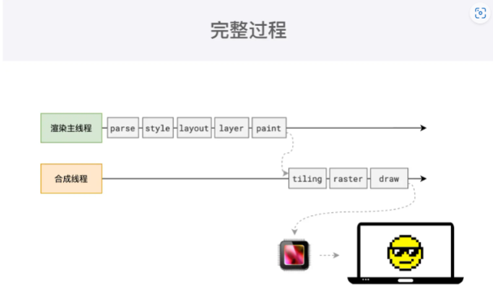

# HTML（超文本标记语言）

::: danger
This is a dangerous warning.
:::

## 1.什么是 DOCTYPE， 有何作用？

用于指定当前文档所采用的HTML版本

DOCTYPE声明不是HTML标签，而是一种指示web浏览器关于页面使用哪个HTML版本进行编写的指令

而且注意，一定要是第一行

```
<!DOCTYPE html>
```

## 2.说说对 html 语义化的理解？

在没有CSS样式情况下也能够让页面呈现出清晰的结构

有利于SEO和搜索引擎建立良好的沟通，有助于爬虫抓取更多的有效信息，爬虫是依赖于标签来确定上下文和各个关键字的权重

方便团队开发和维护，语义化更具可读性，遵循W3C标准的团队都遵循这个标准，可以减少差异化

## 3.前端页面有哪三层构成，分别是什么？

前端页面主要由三层构成，分别是**结构层**、**表示层**和**行为层**。这三层各自承担着不同的角色和功能，共同构成了用户所看到的网页界面

1. **结构层**

   类似于盖房子的地基，也就是由各种各样的标签，组织和展示这些信息

   结构层是页面的骨架，它包含了用户可以直接看到的所有内容

2. **表示层**

   表示层由CSS（层叠样式表）负责创建。CSS用于设置文档的呈现效果，包括颜色、字体、布局、背景等

   表示层决定了网页的外观和样式

3. **行为层**

   行为层由JavaScript语言以及DOM（文档对象模型）主宰。JavaScript是一种脚本语言，用于实现网页的交互性和动态效果

   行为层负责处理网页上的用户交互和动态行为

## 4.什么是严格模式与混杂模式？

### 严格模式（标准模式）

- **定义**：严格模式是指浏览器按照W3C标准（World Wide Web Consortium，万维网联盟）来解析代码。在这种模式下，浏览器会遵循HTML和CSS的最新标准，以最高标准的排版和JavaScript运作模式来渲染页面。
- 特点
  - 遵循最新的HTML和CSS规范。
  - 提供更严格的错误检查和处理。
  - 渲染效果更加统一和可预测。
  - 有助于提升网页的兼容性和可访问性。

### 混杂模式（怪异模式或兼容模式）

- **定义**：混杂模式是指浏览器用自己的方式（通常是模拟老式浏览器的行为）来解析代码。在这种模式下，浏览器会以宽松的向后兼容的方式来显示页面，以便老式的网站能够继续工作。
- 特点
  - 不严格遵循HTML和CSS规范。
  - 渲染效果可能因浏览器而异，导致页面在不同浏览器中的表现不一致。
  - 允许一些过时的HTML和CSS语法，以便兼容老旧的网站。
  - 可能导致一些现代Web技术（如HTML5和CSS3）无法正常工作或表现异常。

### 触发条件（浏览器会根据DOCTYPE声明的存在和类型来判断是否采用严格模式。）

- 严格模式
  - HTML文档包含严格的DOCTYPE声明，如`<!DOCTYPE html>`）
- 混杂模式
  - HTML文档不包含DOCTYPE声明，或者DOCTYPE声明不正确、不完整。

## 5.对于Web标准以及W3C的理解？

`Web标准`简单来说可以分为结构、表现、行为。

其中结构是由HTML各种标签组成，简单来说就是body里面写入标签是为了页面的结构。

表现指的是CSS层叠样式表，通过CSS可以让我们的页面结构标签更具美感。

行为指的是页面和用户具有一定的交互，这部分主要由JS组成

`W3C`，也叫万维网联盟，标准包括HTML、CSS、ECMAScript等等，web标准的制定有很多好处，比如说：

- 学习成本降低，只需要学习标准就行，否则就要学习各个浏览器厂商标准

## 6.行级元素和块级元素分别有哪些及怎么转换？

### 转换

```
display: inline;    //转行内
display: inline-block;  //转行内块
display: block;  //转块
```

### 块级元素

块级元素会**独占一行**，其宽度默认是容器的100%，即一块区域，可以通过CSS设置宽高、内外边距等。常见的块级元素包括：

```
p、div、form、ul、li、ol、table、h1~h6、tr、td、th、tbody、thead、tfoot
```

### 行级元素

行级元素的特点是不会独占一行，其宽度和高度由内容决定，不能通过CSS直接设置

> ​	注意：
>
> - 行内元素设置宽度`width`无效
> - 行内元素设置`height`无效，但是可以通过`line-height`来设置
> - 设置`margin`只有左右有效，上下无效
> - 设置`padding`只有左右有效，上下无效

```
span、a、img、button、input、select
```

行内块元素

行内块元素既具有行级元素的特性（不会独占一行），又具有块级元素的特性（可以设置宽高）。常见的行内块元素包括：

```
img,button
```

## 7.H5有哪些新元素和新特性

1. 语义化标签，如：article、footer、header、nav等
2. 视频video、音频audio
3. 画布canvas
4. 本地离线存储，localStorage长期存储数据，浏览器关闭后数据不丢失，sessionStorage的数据在浏览器关闭
5. 表单控件，time、email
6. 拖拽

## 8.如何使用HTML5中的Canvas元素绘制图形？

简单画一个矩形

```html
<canvas id="myCanvas" width="200" height="200"></canvas>
<script>
  var canvas = document.getElementById("myCanvas");
  var ctx = canvas.getContext("2d");
  ctx.fillStyle = "red";
  ctx.fillRect(50, 50, 100, 100);
</script>
```

在这个示例中，使用 `document.getElementById()` 方法获取 `Canvas` 元素，

 `getContext(“2d”)` 获取2D绘图上下文。 

使用 `fillStyle` 属性设置填充颜色，`fillRect()` 方法绘制一个矩形。

## 9. cookie、sessionStorage 和 localStorage 的区别

|                                                    | cookie                                               | localStorage | sessionStorage |
| -------------------------------------------------- | ---------------------------------------------------- | ------------ | -------------- |
| 由谁初始化                                         | 客户端或服务器，服务器可以使用 `Set-Cookie` 请求头。 | 客户端       | 客户端         |
| 过期时间                                           | 手动设置                                             | 永不过期     | 当前页面关闭时 |
| 在当前浏览器会话（browser sessions）中是否保持不变 | 取决于是否设置了过期时间                             | 是           | 否             |
| 是否随着每个 HTTP 请求发送给服务器                 | 是，Cookies 会通过 `Cookie` 请求头，自动发送给服务器 | 否           | 否             |
| 容量（每个域名）                                   | 4kb                                                  | 5MB          | 5MB            |
| 访问权限                                           | 任意窗口                                             | 任意窗口     | 当前页面窗口   |

### 1.存储数据的生命周期

1. **Cookie**的生命周期由开发者设置，可以设置过期时间（expires）或最大存活时间（max-age），如果未设置，则默认在浏览器会话结束时失效（即关闭浏览器后）
2. **sessionStorage**：sessionStorage的生命周期仅限于当前浏览器会话（标签页或窗口）。一旦浏览器窗口或标签页被关闭，存储在sessionStorage中的数据就会被清除。
3. **localStorage**：localStorage的生命周期非常长，除非用户手动清除，或者浏览器出于安全考虑（如存储空间不足）自动清除，否则数据将一直存储在用户的浏览器中。

### 2.存储大小

1. **Cookie**：由于Cookie会随着HTTP请求发送到服务器，因此其大小受到限制，以避免对性能产生太大影响。一般来说，单个Cookie的大小限制在4KB左右，整个域名下的Cookie总数和总大小也有限制。
2. **sessionStorage** 和 **localStorage**：这两者的存储容量相对较大，通常可以达到5MB或更高（具体取决于浏览器实现）。这使得它们能够存储更多的数据，如用户设置、缓存数据等。

### 3.与服务器端的通信

- **Cookie**：Cookie会在浏览器和服务器之间传递，每次HTTP请求都会携带Cookie信息（除非设置了Cookie的HttpOnly属性，该属性会阻止客户端JavaScript访问Cookie）。这使得Cookie成为实现会话跟踪、用户身份验证等功能的常用手段。
- **sessionStorage** 和 **localStorage**：这两种存储方式都是纯客户端的，不会与服务器进行通信。它们的数据存储在用户的浏览器中，只有在用户访问该网站时才能被访问和修改。

### 4.数据的共享性

- **Cookie**：在同一浏览器下，不同标签页或窗口可以共享同一个域名下的Cookie（这取决于Cookie的Path和Domain属性）。
- **sessionStorage**：仅在当前浏览器标签页或窗口中有效，不同标签页或窗口之间无法共享数据。
- **localStorage**：在同一浏览器下，所有标签页和窗口都可以共享同一个域名下的localStorage数据。

## 10.script、script async 和 script defer 的区别?

```` html
<script>、<script async> 和 <script defer> 三者在HTML中用于引入JavaScript代码，但它们之间存在显著的区别，主要体现在脚本的加载和执行方式上。
````

> ### 1. `<script>`
>
> - **加载与执行**：`<script>` 标签默认是同步加载并阻塞HTML解析的。这意味着浏览器在解析到 `<script>` 标签时会立即停止解析HTML文档，等待脚本加载并执行完毕后，再继续解析HTML文档。如果脚本文件较大或网络状况不佳，这会导致页面渲染的延迟。
> - **应用场景**：适用于脚本体积较小，且对页面渲染顺序有严格要求的情况。
>
> ### 2. `<script async>`
>
> - **加载与执行**：`<script async>` 标签允许脚本异步加载，即脚本的加载与HTML的解析是并行的，不会阻塞HTML的解析。但是，脚本的执行时机是不确定的，一旦脚本加载完成，它就会立即执行，而不考虑脚本在HTML文档中的位置。这可能会导致脚本执行时DOM元素还未完全加载完成，从而引发错误。
> - **应用场景**：适用于那些不依赖DOM元素，或者即使DOM元素未完全加载也不会引发错误的独立脚本。
>
> ### 3. `<script defer>`
>
> - **加载与执行**：`<script defer>` 标签也是异步加载脚本，但与 `<script async>` 不同的是，`defer` 脚本会等到整个HTML文档解析完成后，再按照它们在HTML文档中出现的顺序依次执行。这意味着，即使脚本加载完成，它也不会立即执行，而是等待所有DOM元素加载完成后再执行，从而保证了脚本执行时DOM的完整性。
> - **应用场景**：适用于那些依赖于DOM元素，且需要确保DOM完全加载后再执行的脚本。

|                 | `<script>`                           | `<script async>`                           | `<script defer>`                             |
| --------------- | ------------------------------------ | ------------------------------------------ | -------------------------------------------- |
| **加载方式**    | 同步加载，阻塞HTML解析               | 异步加载，与HTML解析并行                   | 异步加载，与HTML解析并行                     |
| **执行时机**    | 立即执行，阻塞后续内容               | 加载完成后立即执行，不考虑HTML文档解析进度 | HTML文档解析完成后，按在文档中的顺序依次执行 |
| **对DOM的依赖** | 可能在执行时DOM未完全加载            | 可能在执行时DOM未完全加载                  | 确保执行时DOM已完全加载                      |
| **应用场景**    | 脚本体积小，对页面渲染顺序有严格要求 | 独立脚本，不依赖DOM元素                    |                                              |

## 11.iframe的作用以及优缺点

### iframe的优缺点

#### 优点

1. **独立性**：iframe可以在页面上独立显示一个页面或内容，不会与页面其他元素产生冲突。
2. **重用性**：iframe可以在多个页面中重用同一个页面或内容，减少代码的冗余。
3. **异步加载**：iframe的加载是异步的，页面可以在不等待iframe加载完成的情况下进行展示。
4. **跨域访问**：使用iframe可以方便地实现跨域访问，这在某些场景下非常有用。

#### 缺点

1. **管理复杂**：iframe会产生很多页面，增加了管理的复杂性。
2. **搜索引擎优化（SEO）问题**：iframe框架的内容无法被搜索引擎有效捕获，这可能会影响页面的搜索排名。
3. **兼容性差**：iframe的兼容性相对较差，可能在不同浏览器或设备上表现不一致。
4. **安全风险**：iframe可以嵌入来自其他网站的内容，这可能会带来安全风险，如点击劫持等攻击。
5. **性能影响**：iframe中的内容需要额外的HTTP请求和页面加载时间，可能会影响整个页面的加载速度。
6. **可访问性问题**：有些屏幕阅读器可能无法正确读取iframe中的内容，影响网站的可访问性。

### 使用

```html
<!DOCTYPE html>
<html lang="en">

<head>
  <meta charset="UTF-8">
  <meta name="viewport" content="width=device-width, initial-scale=1.0">
  <title>Document</title>
</head>

<body>
  <div>我是页面</div>
  <iframe src="https://juejin.cn/post/7316349850855211046#heading-6://www.example.com" width="600"
    height="400">
  </iframe>
  <button>按钮</button>
</body>
</html>
```

## 12.Quirks（怪癖）模式是什么？它和Standards（标准）有什么区别？

|                | Quirks模式                            | Standards模式                        |
| -------------- | ------------------------------------- | ------------------------------------ |
| **目的**       | 为了与旧版本的HTML文档兼容            | 遵循HTML5和现代Web标准               |
| **盒模型**     | IE浏览器宽度和高度包含padding和border | 标准盒模型，边距和填充不影响实际大小 |
| **浮动和定位** | 行为可能与标准模式不同                | 行为更一致，容易控制                 |
| **垂直对齐**   | 可能不一致，需要额外样式修复          | 行为更一致                           |
| **默认字体**   | 可能使用不同默认字体                  | 使用相同默认字体                     |

### 触发方式

这两种模式的触发方式通常是通过文档类型（DOCTYPE）声明来确定的。如果没有指定文档类型或使用了旧的文档类型，浏览器可能会进入Quirks模式。而使用现代的文档类型声明，如`<!DOCTYPE html>`，则浏览器会进入Standards模式

## 13.meta viewport 是做什么用的，怎么写？

Viewport，适配移动端，可以控制视口的大小和比例：

```html
<meta name="viewport" content="width=device-width, initial-scale=1, maximum-scale=1 user-scalable=no">
```

width viewport ：宽度(数值/device-width)

height viewport ：高度(数值/device-height)

initial-scale ：初始缩放比例

maximum-scale ：最大缩放比例

minimum-scale ：最小缩放比例

user-scalable ：是否允许用户缩放(yes/no）

## 14.浏览器渲染原理？

### 第一步  解析html（Document Object Model Tree）

 构建出DOM树

### 第二步  解析css (CSS Object Model Tree)

构建出CSSOM树

### 第三步  有可能遇到JS  

遇到 JS 的script标签时必须暂停一切行为，等待下载 JS 文件

因为 可能会  修改DOM  修改CSSOM 

### 第四步  构建渲染树 （Render Tree）  

通过遍历 DOM 树，为每一个 DOM 节点，计算它的**所有** CSS 属性

### 第五步 布局 （Layout ） 

 构建出布局树，浏览器计算每个渲染节点计算位置和尺寸

### 第六步 分层  （Layering）  

根据布局树生成分层树，将布局树中的元素分解为多个层   可以提高绘制和重新绘制性能  z-index`，`opacity`，`transform

### 第七步  绘制  （Painting）  

根据分层树进行生成绘制步骤复合图层

转像素，分为多个绘制阶段包括 颜色、边框、阴影、背景图片

### 第八步 分块（Tiling）

浏览器提高渲染效率 ，会把页面分成多个图块，并行处理不同区域的渲染任务，加快渲染速度

会优先画出视口内以及接近视口的内容

### 第九步 光栅化 （Rasterization）

光栅化将每个图块变成位图，既然上一步已经分块了，这一步自然是优先处理接近视口的块。

位图：可以简单理解成用二维数组存储的像素信息。

### 第10步合成（Compositing） 

计算出每个位图在屏幕上的位置，交给GPU进行最终呈现

### 第11步 显示 （Display）

图像数据会从GPU的显存中读取，然后就可以看到了



## 15.重排和重绘的区别？

### 重绘（Repaint）

影响元素外观，不影响布局会触发重绘

比如：修改了 元素颜色，背景颜色，阴影

**示例：**

- 修改元素的 `color`、`background-color`、`visibility` 等。
- 设置 `border-color`、`box-shadow` 等属性。

**特点：**

- 重绘不会引发布局变化，所以它的性能开销相对较小。

### 重排（Reflow）

重排，也称为回流，是指当页面布局发生变化时，浏览器需要重新计算文档的布局

重排会影响到页面上部分甚至全部的元素位置和大小。

**示例：**

- 添加或删除 DOM 元素。
- 修改元素的尺寸（如 `width`、`height`、`padding`、`margin`）。
- 修改字体大小、显示属性（如 `display: none` -> `display: block`）等。
- 浏览器窗口的大小变化，导致整个页面的布局需要重新计算。

**特点：**

- 重排的代价通常比重绘高，因为它不仅要重新计算受影响元素的几何属性，还可能影响其后代和兄弟元素。
- 在大型文档或复杂布局中，频繁的重排可能会严重影响性能。

### **重绘与重排的关系**

- **重排通常会引发重绘**：因为元素的位置或大小发生了变化，浏览器需要重新绘制页面的某些部分。但反过来，重绘并不一定会引发重排。
- **性能影响**：重排比重绘的性能影响大得多，尤其是在复杂的页面结构或大型文档中。因此，在优化页面性能时，应该尽量减少引发重排的操作。

### **总结**

- **重绘**：只涉及外观改变的更新，不影响布局，性能开销相对较小。
- **重排**：涉及布局的重新计算，影响更大，性能开销较大。


