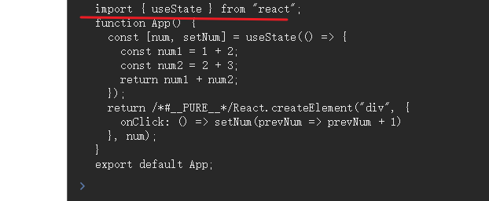
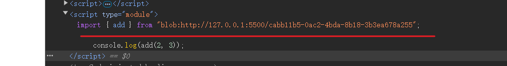

# 介绍

1. 想要实现react文件的预览 tsx肯定是要解决的  要转成js浏览器才认识，jsx，tsx肯定得结果bable编译才可以
2. 编译后import  url问题 使用blob url 解决

::: danger 关键

 @babel/standalone       可以用它实时把 tsx 代码编译为 js


:::

## tsx 代码编译为 js （解决方案 ：@babel/standalone ）

### 安装依赖

```bash
npm i --save @babel/standalone

npm i --save-dev @types/babel__standalone
```

### 代码

```tsx
import { useRef, useState } from 'react'
import { transform } from '@babel/standalone'

function App() {
  const textareaRef = useRef<HTMLTextAreaElement>(null)

  function onClick() {
    if (!textareaRef.current) {
      return
    }

    const res = transform(textareaRef.current.value, {
      presets: ['react', 'typescript'],
      filename: 'guang.tsx',
    })
    console.log(res.code)
  }

  const code = `import { useEffect, useState } from "react";

  function App() {
    const [num, setNum] = useState(() => {
      const num1 = 1 + 2;
      const num2 = 2 + 3;
      return num1 + num2
    });
  
    return (
      <div onClick={() => setNum((prevNum) => prevNum + 1)}>{num}</div>
    );
  }
  
  export default App;
  `
  return (
    <div>
      <textarea
        ref={textareaRef}
        style={{ width: '500px', height: '300px' }}
        defaultValue={code}
      ></textarea>
      <button onClick={onClick}>编译</button>
    </div>
  )
}

export default App
```

### 编译

```tsx
import { useEffect, useState } from "react";

  function App() {
    const [num, setNum] = useState(() => {
      const num1 = 1 + 2;
      const num2 = 2 + 3;
      return num1 + num2
    });
  
    return (
      <div onClick={() => setNum((prevNum) => prevNum + 1)}>{num}</div>
    );
  }
  
  export default App;

```

编译后

```js
import { useState } from "react";
function App() {
  const [num, setNum] = useState(() => {
    const num1 = 1 + 2;
    const num2 = 2 + 3;
    return num1 + num2;
  });
  return /*#__PURE__*/React.createElement("div", {
    onClick: () => setNum(prevNum => prevNum + 1)
  }, num);
}
export default App;
```

编译后的代码其实还是有问题的，注意看



运行代码的时候，会引入 import 的模块，这时会找不到

## 编译后import  url问题（解决方案：blob url）

### 了解

```tsx
<!DOCTYPE html>
<html lang="en">
<head>
    <meta charset="UTF-8">
    <meta name="viewport" content="width=device-width, initial-scale=1.0">
    <title>Document</title>
</head>
<body>

<script>
    const code1 =`
    function add(a, b) {
        return a + b;
    }
    export { add };
    `;

    const url = URL.createObjectURL(new Blob([code1], { type: 'application/javascript' }));
    const code2 = `import { add } from "${url}";

    console.log(add(2, 3));`;

    const script = document.createElement('script');
    script.type="module";
    script.textContent = code2;
    document.body.appendChild(script);
</script>
</body>
</html>

```



怎么回事呢

```js
 	 const script = document.createElement('script');    //创建一个script标签
    script.type="module";							  //给type类型是module
    script.textContent = code2;						  //  添加 处理后的url
    document.body.appendChild(script);				//body下面创建一个处理好的script标签
```

这时候就奇迹的实现了

可以把一段 JS 代码，用 URL.createObjectURL 和 new Blob 的方式变为一个 url：

```js
URL.createObjectURL(new Blob([代码], { type: 'application/javascript' }))
```

## 切换文件怎么做呢（解决方案： ）